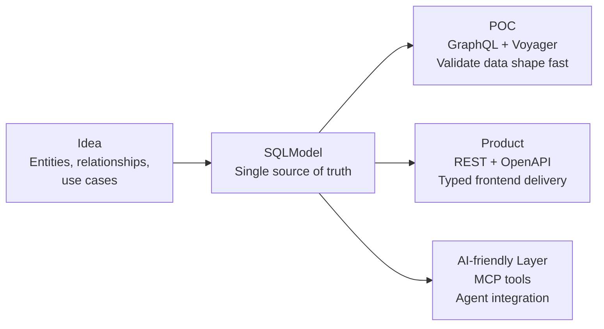

# nexusx

A framework for business layer

[](https://pypi.python.org/pypi/nexusx)
[](https://pepy.tech/projects/nexusx)


nexusx is a model-first workflow for building AI-friendly applications.

Start with an idea, turn it into a working POC quickly, then keep evolving the same model into production APIs instead of rebuilding the stack at each stage. You define SQLModel entities and relationships once, then use GraphQL to validate the model, REST + OpenAPI to ship typed frontend-facing APIs, and MCP to expose the same capabilities to AI agents.



## Two ways to build with nexusx

- **Manually** — use the API directly (GraphQL / Core API / MCP). Start at [Install](#install) and read straight down.
- **AI-guided** — let an AI coding agent run a structured 4-phase workflow (idea → POC → product → TS SDK). Jump to [AI Bootstrap](#ai-bootstrap).

If you're evaluating the library, read top to bottom. If you want the agent workflow, skip ahead to the skill.

## From Idea to Product

One model moves through each delivery stage without rewriting your API surface — **GraphQL for validation, REST for delivery, MCP for AI.**

At the idea stage, you want feedback quickly: are the entities right, are the relationships right, does the shape of the response support the use case? GraphQL gives you that shortest path. Once the POC proves the model, `DefineSubset` DTOs and route generation turn the same entities into N+1-safe FastAPI endpoints with OpenAPI output, so frontend delivery stops depending on hand-written DTO duplication. When the product also needs to serve AI, the same model and service definitions can be exposed through MCP with progressive disclosure, from schema discovery to method execution.

| Stage | What you get |
|-------|-------------|
| Idea | model entities, relationships, and use cases once in SQLModel |
| POC | `@query` / `@mutation` + GraphQLHandler → quickly verify relationships and response shapes |
| Product | `DefineSubset` DTOs + FastAPI/OpenAPI → stable typed APIs for frontend delivery |
| AI-friendly Product | MCP server exposing the same model and service capabilities to AI assistants |
| Team Understanding | Voyager gives a visual map of entities and service structure |

## Quick start

One command to start all demo services:

```bash
bash start_all.sh
```

| Service | Port | URL |
|---------|------|-----|
| demo GraphQL | 8000 | http://localhost:8000/graphql |
| demo CoreAPI | 8001 | http://localhost:8001/api/sprints |
| auth GraphQL | 8002 | http://localhost:8002/graphql |
| auth MCP | 8003 | http://localhost:8003/mcp |
| multi-app MCP | 8004 | http://localhost:8004/mcp |
| demo paginated | 8005 | http://localhost:8005/graphql |
| demo UseCase MCP | 8006 | http://localhost:8006/mcp |
| demo UseCase FastAPI | 8007 | http://localhost:8007/api/sprints |
| demo Voyager | 8008 | http://localhost:8008/voyager |

Press `Ctrl+C` to stop all services.

To start individual services:

## Read This README in Order

We reuse one example throughout: **Sprint → Task → User**.

- A `Sprint` has many `Task`s
- A `Task` has one `owner` (a `User`)
- The API also wants derived fields such as `task_count` and `contributors`

The concepts appear in this order because they mirror the delivery path from idea to product:

1. **GraphQL Mode** — the fastest path from SQLModel to a running POC
2. **Core API Mode** — DefineSubset DTOs for REST endpoints, progressing from implicit auto-loading to `resolve_*`, `post_*`, and cross-layer data flow
3. **MCP Server** — expose the same model and services to AI assistants
4. **UseCase Services** — organize production business capabilities for MCP and web frameworks

## What nexusx Gives You

| Need | What you write | What the framework does |
|------|----------------|-------------------------|
| GraphQL API | `@query` / `@mutation` on SQLModel methods | Auto-generates SDL, resolves relationships via DataLoader |
| REST / use-case DTOs | `DefineSubset` + field declarations | Implicit auto-loading, N+1 prevention, ORM→DTO conversion |
| Derived fields | `post_*` methods | Runs after all nested data is resolved |
| Cross-layer data flow | `ExposeAs`, `SendTo`, `Collector` | Pass context down or aggregate values up |
| Non-ORM relationships | `Relationship(...)` on entity | Same DataLoader infra, same auto-loading |
| AI-ready APIs | `create_simple_mcp_server(base=...)` | Progressive-disclosure MCP tools |
| Business services | `UseCaseService` subclass with `@query`/`@mutation` methods | Auto-discovery, SDL introspection, MCP + FastAPI dual serving |
| DTO query building | `build_dto_select(DtoClass, where=...)` | Builds SQL SELECT from DefineSubset DTO fields |
| Auto REST routes | `create_use_case_router(config)` | Generates POST routes from UseCaseService methods |

## Install

```bash
pip install nexusx
pip install nexusx[fastmcp]  # with MCP support
```

---

## GraphQL Mode

The fastest path: SQLModel + `@query` decorator → running GraphQL API.

### 30-Second Quick Start

```python
from fastapi import FastAPI
from fastapi.responses import HTMLResponse
from pydantic import BaseModel
from sqlmodel import SQLModel, Field, Relationship, select
from nexusx import query, mutation, GraphQLHandler

class User(SQLModel, table=True):
    id: int | None = Field(default=None, primary_key=True)
    name: str
    email: str

class Post(SQLModel, table=True):
    id: int | None = Field(default=None, primary_key=True)
    title: str
    author_id: int = Field(foreign_key="user.id")
    author: User | None = Relationship(back_populates="posts")

    @query
    async def get_all(cls, limit: int = 10) -> list['Post']:
        """Get all posts."""
        async with get_session() as session:
            return (await session.exec(select(cls).limit(limit))).all()

    @mutation
    async def create(cls, title: str, author_id: int) -> 'Post':
        """Create a new post."""
        async with get_session() as session:
            post = cls(title=title, author_id=author_id)
            session.add(post)
            await session.commit()
            await session.refresh(post)
            return post

handler = GraphQLHandler(base=SQLModel, session_factory=async_session)

class GraphQLRequest(BaseModel):
    query: str

app = FastAPI()

@app.get("/graphql", response_class=HTMLResponse)
async def graphiql():
    return handler.get_graphiql_html()

@app.post("/graphql")
async def graphql(req: GraphQLRequest):
    return await handler.execute(req.query)
```

Run `uvicorn app:app` and visit `http://localhost:8000/graphql`.

### Relationships Auto-Resolved

Relationships are resolved automatically via DataLoader. No `selectinload`, no manual joins:

```graphql
{
  postGetAll(limit: 5) {
    id
    title
    author { name email }
  }
}
```

The framework walks the GraphQL selection tree level-by-level, collects FK values, and batch-loads via DataLoader. **One query per relationship, regardless of result size.**

### Pagination

Add `order_by` to list relationships for automatic pagination support:

```python
class User(SQLModel, table=True):
    id: int | None = Field(default=None, primary_key=True)
    name: str
    posts: list["Post"] = Relationship(
        back_populates="author",
        sa_relationship_kwargs={"order_by": "Post.id"},
    )

handler = GraphQLHandler(base=SQLModel, session_factory=async_session, enable_pagination=True)
```

```graphql
{
  userGetAll {
    name
    posts(limit: 3, offset: 0) {
      items { title }
      pagination { has_more total_count }
    }
  }
}
```

### Auto-Generated Standard Queries

Skip `@query` decorators entirely — let the framework generate `by_id` and `by_filter` for every entity:

```python
from nexusx import GraphQLHandler, AutoQueryConfig

handler = GraphQLHandler(
    base=SQLModel,
    session_factory=async_session,
    auto_query_config=AutoQueryConfig(session_factory=async_session),
)
```

```graphql
{ userById(id: 1) { name email } }
{ userByFilter(filter: { name: "Alice" }, limit: 5) { id name } }
```

---

## Core API Mode

Use Core API mode when you want the same DataLoader-based batching outside GraphQL — for FastAPI REST endpoints, service-layer response assembly, or any use-case DTO.

The concepts progress in order: **auto-loading → resolve_\* → post_\* → cross-layer flow**.

### Step 1: DefineSubset + Implicit Auto-Loading

The simplest Core API case: select fields from SQLModel entities, declare relationship fields — they load automatically.

```python
from sqlmodel import SQLModel
from nexusx import DefineSubset, ErManager

class UserDTO(DefineSubset):
    __subset__ = (User, ("id", "name"))

class TaskDTO(DefineSubset):
    __subset__ = (Task, ("id", "title", "owner_id"))
    owner: UserDTO | None = None   # name matches Task.owner relationship → auto-loaded

class SprintDTO(DefineSubset):
    __subset__ = (Sprint, ("id", "name"))
    tasks: list[TaskDTO] = []      # name matches Sprint.tasks relationship → auto-loaded

# App startup — once
er = ErManager(base=SQLModel, session_factory=async_session)
Resolver = er.create_resolver()

# Per request
async def get_sprints():
    async with async_session() as session:
        sprints = (await session.exec(select(Sprint))).all()
    dtos = [SprintDTO(id=s.id, name=s.name) for s in sprints]
    return await Resolver().resolve(dtos)
```

**How it works:**
- `ErManager` discovers all SQLModel entities and their ORM relationships
- `create_resolver()` returns a Resolver class bound to that entity graph
- When resolving, if a field name matches a relationship and the DTO type is compatible with the target entity, it's loaded via DataLoader automatically
- FK fields (like `owner_id`) are hidden from serialization output but available internally

This is the Core API equivalent of GraphQL's relationship resolution — same DataLoader batching, zero `resolve_*` methods needed for standard relationships.

### Step 2: `resolve_*` for Custom Loading

Use `resolve_*` when implicit auto-loading doesn't fit: the field name doesn't match a relationship, or you need custom logic.

```python
from pydantic_resolve import Loader

async def comments_loader(task_ids: list[int]) -> list[list[Comment]]:
    """Batch load comments for multiple tasks."""
    ...

class TaskDTO(DefineSubset):
    __subset__ = (Task, ("id", "title", "owner_id"))
    owner: UserDTO | None = None          # implicit — matches Task.owner
    comments: list[CommentDTO] = []       # custom — no matching relationship
    comment_count: int = 0

    def resolve_comments(self, loader=Loader(comments_loader)):
        """Load comments via a custom batch function."""
        return loader.load(self.id)

    def post_comment_count(self):
        return len(self.comments)
```

`Loader` accepts a DataLoader class or an async batch function:

```python
# By DataLoader class
def resolve_tags(self, loader=Loader(TagLoader)):
    return loader.load(self.id)

# By async batch function
async def load_permissions(user_ids):
    ...
def resolve_permissions(self, loader=Loader(load_permissions)):
    return loader.load(self.owner_id)
```

A useful mental model: **`resolve_*` means "this field needs data from outside the current node."**

### Step 3: `post_*` — Derived Fields After Children Are Ready

`post_*` runs after all `resolve_*` and auto-loading completes for the current subtree. Use it for counts, aggregations, formatting — anything that depends on already-loaded data.

```python
class SprintDTO(DefineSubset):
    __subset__ = (Sprint, ("id", "name"))
    tasks: list[TaskDTO] = []
    task_count: int = 0
    contributor_names: list[str] = []

    def post_task_count(self):
        return len(self.tasks)

    def post_contributor_names(self):
        return sorted({t.owner.name for t in self.tasks if t.owner})
```

Execution order for one SprintDTO:

1. Implicit auto-load → `tasks` filled with TaskDTOs
2. Each TaskDTO → implicit auto-load → `owner` filled
3. `post_task_count` → `len(self.tasks)` = 2
4. `post_contributor_names` → extract unique owner names

| Question | `resolve_*` | `post_*` |
|----------|-------------|----------|
| Needs external IO? | Yes | Usually no |
| Runs before descendants are ready? | Yes | No |
| Good for counts, sums, labels? | Sometimes | Yes |

### Step 4: Cross-Layer Data Flow

Reach for these tools only when parent and child nodes need to coordinate.

- **`ExposeAs`**: send ancestor data downward (parent → descendant)
- **`SendTo` + `Collector`**: send child data upward (descendant → ancestor)

```python
from typing import Annotated
from nexusx import ExposeAs, SendTo, Collector

class SprintDTO(DefineSubset):
    __subset__ = (Sprint, ("id", "name"))
    name: Annotated[str, ExposeAs('sprint_name')]     # expose to descendants
    tasks: list[TaskDTO] = []
    contributors: list[UserDTO] = []

    def post_contributors(self, collector=Collector('contributors')):
        return collector.values()                      # collect from descendants

class TaskDTO(DefineSubset):
    __subset__ = (Task, ("id", "title", "owner_id"))
    owner: Annotated[UserDTO | None, SendTo('contributors')] = None  # send upward
    full_title: str = ""

    def post_full_title(self, ancestor_context):
        return f"{ancestor_context['sprint_name']} / {self.title}"   # read from ancestor
```

Use this only when the shape of the tree matters:
- A child needs ancestor context (sprint name, permissions)
- A parent needs to aggregate values from many descendants (contributors, tags)

### Step 5: Custom Relationships

For relationships that aren't in the ORM (cross-service calls, computed edges), declare them on the entity:

```python
from nexusx import Relationship

async def tags_loader(task_ids: list[int]) -> list[list[Tag]]:
    """Batch load tags for multiple tasks."""
    ...

class Task(SQLModel, table=True):
    __relationships__ = [
        Relationship(fk="id", target=list[Tag], name="tags", loader=tags_loader)
    ]
    id: int | None = Field(default=None, primary_key=True)
    title: str

class TagDTO(DefineSubset):
    __subset__ = (Tag, ("id", "name"))

class TaskDTO(DefineSubset):
    __subset__ = (Task, ("id", "title"))
    tags: list[TagDTO] = []   # name matches custom relationship → auto-loaded
```

Custom relationships use the same DataLoader infrastructure and work with implicit auto-loading.

---

## MCP Integration

Expose your SQLModel APIs to AI assistants with one function call.

### Simple MCP Server

```python
from nexusx.mcp import create_simple_mcp_server

mcp = create_simple_mcp_server(base=SQLModel, name="My API")
mcp.run()  # stdio mode
```

Before pushing changes, run the same checks as CI:

```bash
./scripts/check-ci.sh
```

Tools: `get_schema()`, `graphql_query(query)`, `graphql_mutation(mutation)`.

### Multi-App MCP Server

```python
from nexusx.mcp import create_mcp_server

mcp = create_mcp_server(
    apps=[
        {"name": "blog", "base": BlogBase, "description": "Blog API"},
        {"name": "shop", "base": ShopBase, "description": "Shop API"},
    ],
    name="Multi-App API",
)
mcp.run()
```

Tools include `list_apps()`, `list_queries(app_name)`, `get_query_schema(name, app_name)`, `graphql_query(query, app_name)`, etc.

```bash
pip install nexusx[fastmcp]
```

---

## UseCase Services

Define business logic as service classes, expose them to both MCP and web frameworks from a single source of truth.

### Define Services

`UseCaseService` subclasses declare methods decorated with `@query` / `@mutation`. The metaclass auto-discovers decorated methods.

```python
from nexusx import UseCaseService, query, build_dto_select

class SprintService(UseCaseService):
    """Sprint management service."""

    @query
    async def list_sprints(cls) -> list[SprintSummary]:
        """Get all sprints with task counts."""
        stmt = build_dto_select(SprintSummary)
        async with async_session() as session:
            rows = (await session.exec(stmt)).all()
        dtos = [SprintSummary(**dict(row._mapping)) for row in rows]
        return await Resolver().resolve(dtos)

    @query
    async def get_sprint(cls, sprint_id: int) -> SprintSummary | None:
        """Get a sprint by ID."""
        stmt = build_dto_select(SprintSummary, where=Sprint.id == sprint_id)
        async with async_session() as session:
            rows = (await session.exec(stmt)).all()
        if not rows:
            return None
        dto = SprintSummary(**dict(rows[0]._mapping))
        return await Resolver().resolve(dto)
```

### Expose to MCP

Four-layer progressive disclosure: discover apps → discover services → inspect → execute.

```python
from nexusx import create_use_case_mcp_server, UseCaseAppConfig

mcp = create_use_case_mcp_server(
    apps=[
        UseCaseAppConfig(
            name="project",
            services=[SprintService, TaskService],
            description="Project management",
        ),
    ],
    name="Project UseCase API",
)
mcp.run()  # stdio mode
```

MCP tools provided:

| Tool | Purpose |
|------|---------|
| `list_apps()` | Discover available applications and service counts |
| `list_services(app_name)` | List services and method counts in an app |
| `describe_service(app_name, service_name)` | Method signatures (SDL format) + DTO type definitions |
| `call_use_case(app_name, service_name, method_name, params)` | Execute a method |

`describe_service` returns SDL-style signatures and type definitions:

```json
{
  "name": "sprint",
  "methods": [
    {"name": "list_sprints", "signature_sdl": "list_sprints(): [SprintSummary!]!"},
    {"name": "get_sprint", "signature_sdl": "get_sprint(sprint_id: Int!): SprintSummary"}
  ],
  "types": "type SprintSummary {\n  id: Int\n  name: String!\n  tasks: [TaskSummary!]!\n  ...\n}"
}
```

### Auto-Generate REST Routes

Use `create_use_case_router()` to generate POST routes from UseCaseService methods — zero boilerplate.

```python
from nexusx import create_use_case_router, UseCaseAppConfig

router = create_use_case_router(
    UseCaseAppConfig(
        name="project",
        services=[SprintService, TaskService],
    ),
)
app.include_router(router)
```

Routes: `POST /api/sprint_service/list_sprints`, `POST /api/sprint_service/get_sprint`, etc.

### Manual REST Routes

The same service classes integrate directly into FastAPI or any async web framework. Routes are thin wrappers — business logic stays in the service.

```python
from fastapi import FastAPI, HTTPException

app = FastAPI()

@app.get("/api/sprints", tags=[SprintService.get_tag_name()])
async def get_sprints():
    return await SprintService.list_sprints()

@app.get("/api/sprints/{sprint_id}", tags=[SprintService.get_tag_name()])
async def get_sprint(sprint_id: int):
    result = await SprintService.get_sprint(sprint_id=sprint_id)
    if result is None:
        raise HTTPException(status_code=404, detail="Sprint not found")
    return result
```

`get_tag_name()` returns an OpenAPI-compatible tag name (e.g. `SprintService` → `"sprint"`), so `/docs` groups routes by service automatically.

**One service class, two serving modes:**

```
UseCaseService subclass ──┬── MCP server (AI agents, progressive disclosure)
                          └── FastAPI routes (REST API, OpenAPI docs)
```

---

## Demo


```bash
# GraphQL playground
uv run python -m demo.blog.app
# visit localhost:8000/graphql

# Core API (REST)
uv run uvicorn demo.core_api.app:app --reload
# visit /docs

# MCP server (GraphQL-based)
uv run --with fastmcp python -m demo.blog.mcp_server

# UseCase MCP server (stdio or HTTP)
uv run --with fastmcp python -m demo.use_case.mcp_server          # stdio
uv run --with fastmcp python -m demo.use_case.mcp_server --http   # HTTP on port 8006

# UseCase FastAPI — same services served as REST endpoints
uv run uvicorn demo.use_case.fastapi:app --port 8007
# visit /docs to see routes grouped by service tag
```

## AI Bootstrap

> The fastest way to build with nexusx is to let an AI coding agent drive a
> guided workflow that carries one model across its **whole lifecycle** —
> idea → POC → product → TS SDK — not just initial scaffolding.

This repo ships a [skill](./skill/) in the standard `SKILL.md` format,
supported by both Claude Code and OpenAI Codex.

**For the agent** — install the skill, then invoke it:

```bash
# Claude Code
ln -s $(pwd)/skill ~/.claude/skills/nexusx-4phase
# then describe your requirements and run: /nexusx-4phase

# OpenAI Codex (repo-scope — travels with the repo)
mkdir -p .agents/skills && ln -s ../../skill .agents/skills/nexusx-4phase
# then start Codex and type: $nexusx-4phase

# OpenAI Codex (user-scope — personal, all repos)
mkdir -p ~/.agents/skills && ln -s $(pwd)/skill ~/.agents/skills/nexusx-4phase
```

| Phase | Focus | Output |
|-------|-------|--------|
| 0 | Clarify the idea | entities, relationships, aggregates, use-case methods |
| 1 | Build the POC model | models + db + voyager |
| 2 | Make the model queryable | service methods, GraphQL queryable |
| 3 | Productize and make it AI-ready | DTOs + services + REST + MCP |
| 4 | Generate the SDK | OpenAPI spec → end-to-end TS SDK |

Each phase uses V-shaped acceptance (define criteria, implement, verify) and
pauses for your confirmation before the next. Full methodology — Phase 0
checklist, acceptance model, spec rules — lives in
[`skill/SKILL.md`](./skill/SKILL.md). Whole-API context for agents:
[`llms-full.txt`](./llms-full.txt).

## License

MIT License
