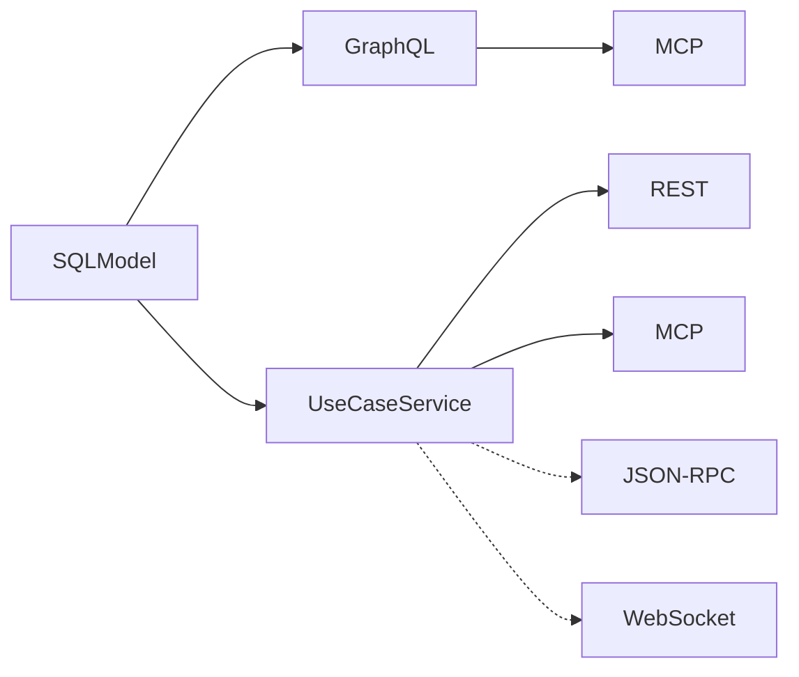

# nexusx

Write SQLModel classes. Get a complete API.

[](https://pypi.python.org/pypi/nexusx)
[](https://pepy.tech/projects/nexusx)

Most projects repeat the same data model three or four times — once for the database, once for the API response, once for GraphQL. nexusx eliminates that. Define your entities and relationships in SQLModel, and you get:

- **GraphQL** — auto-generated schema, relationships resolve automatically, no N+1
- **REST** — typed response DTOs, pick fields like GraphQL but in Python
- **MCP** — your business logic exposed as tools for AI agents

One model, multiple surfaces — and more protocols on the way.



## Install

```bash
pip install nexusx
pip install nexusx[fastmcp]  # with MCP support
```

Requires Python ≥ 3.10.

## Quick Start

### Step 1: Define entities and relationships

```python
from sqlmodel import SQLModel, Field, Relationship, select
from nexusx import query, mutation

class User(SQLModel, table=True):
    id: int | None = Field(default=None, primary_key=True)
    name: str
    posts: list["Post"] = Relationship(back_populates="author")

    @query
    async def get_users(cls, limit: int = 10) -> list["User"]:
        """Get all users."""
        async with get_session() as session:
            return (await session.exec(select(cls).limit(limit))).all()

class Post(SQLModel, table=True):
    id: int | None = Field(default=None, primary_key=True)
    title: str
    author_id: int = Field(foreign_key="user.id")
    author: User | None = Relationship(back_populates="posts")

    @mutation
    async def create_post(cls, title: str, author_id: int) -> "Post":
        """Create a post."""
        async with get_session() as session:
            post = cls(title=title, author_id=author_id)
            session.add(post)
            await session.commit()
            return post
```

### Step 2: Start GraphQL

```python
from nexusx import GraphQLHandler

handler = GraphQLHandler(base=SQLModel, session_factory=async_session)
```

Query relationships — they resolve automatically via DataLoader, one query per level:

```graphql
{
  userGetUsers(limit: 5) {
    name
    posts { title }
  }
}
```

### Step 3: Add typed REST endpoints

When you're ready for production, add `DefineSubset` DTOs on the same entities. `DefineSubset` is the Python equivalent of GraphQL field selection — instead of writing `{ id name }` in a query string, you declare `("id", "name")` in a Python class and get a typed, validated DTO:

```python
from nexusx import DefineSubset, ErManager

class UserDTO(DefineSubset):
    __subset__ = (User, ("id", "name"))

class PostDTO(DefineSubset):
    __subset__ = (Post, ("id", "title", "author_id"))
    author: UserDTO | None = None   # auto-loaded — name matches Post.author

er = ErManager(base=SQLModel, session_factory=async_session)
Resolver = er.create_resolver()

# Per request
dtos = await Resolver().resolve(posts)
```

Relationship fields auto-load when the field name matches a registered relationship. Add `post_*` methods for derived fields, `resolve_*` for custom loading logic.

### Step 4: Expose to AI agents

Package business logic as `UseCaseService` — same class serves both MCP and REST:

```python
from nexusx import UseCaseService, UseCaseAppConfig, create_use_case_mcp_server, create_use_case_router

class SprintService(UseCaseService):
    @query
    async def list_sprints(cls) -> list[SprintSummary]:
        """Get all sprints with task counts."""
        ...

# MCP (AI agents)
mcp = create_use_case_mcp_server(
    apps=[UseCaseAppConfig(name="project", services=[SprintService])],
)
mcp.run()

# REST (FastAPI)
app.include_router(create_use_case_router(
    UseCaseAppConfig(name="project", services=[SprintService])
))
```

### Recap

From a single set of entity definitions, you get:

- **GraphQL** — auto-generated schema with DataLoader relationship resolution
- **REST** — typed DTOs with implicit auto-loading, OpenAPI docs at `/docs`
- **MCP** — four-layer progressive disclosure for AI agents

All three share the same SQLModel entities and the same DataLoader infrastructure.

## How It Compares

| Tool | GraphQL auto-gen | REST + OpenAPI | MCP | N+1 prevention | Relationship auto-loading |
|------|:---:|:---:|:---:|:---:|:---:|
| **nexusx** | yes | yes | yes | yes (DataLoader) | yes (implicit) |
| Strawberry | yes | no | no | manual | manual loader |
| FastAPI + SQLModel | no | yes (manual) | no | no | no |
| Ariadne | yes | no | no | manual | no |
| FastMCP | no | no | yes | no | no |

## Choosing a Mode

| If you want to... | Start with |
|---|---|
| Validate a data model quickly with flexible queries | GraphQL Mode |
| Ship typed REST endpoints for a frontend team | Core API Mode |
| Expose business capabilities to AI agents | UseCase Services |
| Do all three from one model | UseCase Services → embed DTOs inside methods |

The modes compose: a UseCaseService method can internally use `Resolver().resolve(dtos)` for Core API data assembly. They share the same DataLoader engine and the same entities.

## What the Framework Handles

| Your responsibility | Framework's responsibility |
|---|---|
| Define SQLModel entities + relationships | Auto-generate GraphQL SDL |
| Write `@query`/`@mutation` methods | Resolve relationships via DataLoader (one query per level) |
| Declare `DefineSubset` DTOs | Implicit auto-loading of matching relationship fields |
| Write `post_*` methods for derived fields | Execute them after the subtree is fully resolved |
| Declare `ExposeAs`/`SendTo`/`Collector` | Route cross-layer data flow automatically |
| Define `UseCaseService` subclasses | Discover methods, generate MCP tools + FastAPI routes |

## Demos

```bash
git clone https://github.com/allmonday/nexusx.git
cd nexusx
bash start_all.sh
```

| Service | Port | What it shows |
|---------|------|---------------|
| GraphQL playground | 8000 | Auto-generated Schema + DataLoader relationship resolution |
| Core API (REST) | 8001 | DefineSubset DTOs with resolve_*/post_*/cross-layer flow |
| Auth GraphQL | 8002 | Multi-entity auth model with queries + mutations |
| Auth MCP | 8003 | Same auth model exposed as MCP tools |
| Multi-app MCP | 8004 | Two apps sharing one MCP server |
| Paginated GraphQL | 8005 | Relationship pagination (limit/offset) |
| UseCase MCP | 8006 | 4-layer progressive disclosure MCP |
| UseCase FastAPI | 8007 | Same UseCaseService served as OpenAPI-documented REST |
| Voyager | 8008 | Visual entity-relationship map |

## AI Agent Skill

A [4-phase skill](./skill/) guides AI coding agents through the full nexusx workflow: clarify requirements → build POC model → add queries → productize.

```bash
ln -s $(pwd)/skill ~/.claude/skills/nexusx-4phase
```

## Development

```bash
./scripts/check-ci.sh       # Run full CI checks (lint + type-check + tests)
uv run pytest               # Run tests only
uv run ruff check src/ tests/  # Lint only
uv run mypy src/            # Type-check only
```

## Documentation

- [API docs](docs/) — per-mode guides for GraphQL, Core API, and UseCase
- [Clean Architecture comparison](docs/clean-architecture-comparison.md) — nexusx vs Django/DRF, Strawberry, Litestar, and more

## License

MIT
