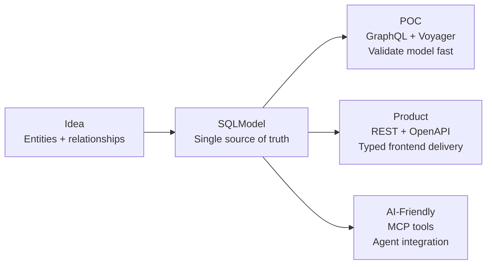

# nexusx

Define once, serve everywhere — GraphQL for validation, REST for production, MCP for AI agents.

[](https://pypi.python.org/pypi/nexusx)
[](https://pepy.tech/projects/nexusx)


nexusx turns your SQLModel entities into a complete API surface without rewriting the stack at each stage. Start with a quick GraphQL POC to validate your data model, ship typed REST endpoints for your frontend, and expose the same capabilities to AI agents through MCP — all from a single set of entity definitions.



## The Problem

Frameworks force you to choose: GraphQL-first tools (Strawberry, Ariadne) give you schema generation but leave you on your own for REST endpoints. REST-first tools (FastAPI) give you OpenAPI but no GraphQL or MCP. MCP frameworks add yet another layer of duplication.

The result: three code paths that define the same entities, the same relationships, the same data shapes — in three slightly different ways. When the model changes, you fix it in three places. When a new hire joins, they learn three APIs.

**nexusx gives you one model and three delivery paths.** Define your entities and relationships once in SQLModel, and the framework generates all three from that single source.

## How It Compares

| Tool | GraphQL auto-gen | REST + OpenAPI | MCP | N+1 prevention | Relationship auto-loading |
|------|:---:|:---:|:---:|:---:|:---:|
| **nexusx** | ✅ | ✅ | ✅ | ✅ DataLoader | ✅ implicit |
| Strawberry | ✅ | ❌ | ❌ | ⚠️ manual | ⚠️ manual loader |
| FastAPI + SQLModel | ❌ | ✅ (manual) | ❌ | ❌ | ❌ |
| Ariadne | ✅ | ❌ | ❌ | ⚠️ manual | ❌ |
| FastMCP | ❌ | ❌ | ✅ | ❌ | ❌ |

nexusx is the only framework that takes you from model definition to GraphQL, REST, and MCP without duplicating logic.

## Install

```bash
pip install nexusx
pip install nexusx[fastmcp]  # with MCP support
```

Requires Python ≥ 3.10.

## Quick Start

```bash
git clone https://github.com/allmonday/nexusx.git
cd nexusx
bash start_all.sh
```

This launches the full demo suite:

| Service | Port | What it shows |
|---------|------|---------------|
| GraphQL playground | 8000 | Auto-generated Schema + DataLoader relationship resolution |
| Core API (REST) | 8001 | DefineSubset DTOs with resolve_*/post_*/cross-layer flow |
| Auth GraphQL | 8002 | Multi-entity auth model with queries + mutations |
| Auth MCP | 8003 | Same auth model exposed as MCP tools |
| Multi-app MCP | 8004 | Two apps sharing one MCP server |
| Paginated GraphQL | 8005 | Relationship pagination (limit/offset) |
| UseCase MCP | 8006 | 4-layer progressive disclosure MCP |
| UseCase FastAPI | 8007 | Same UseCaseService served as OpenAPI-documented REST |
| Voyager | 8008 | Visual entity-relationship map |

## Three Modes, One Model

nexusx offers three modes, each serving a different stage of the delivery pipeline. They share the same SQLModel entities and the same DataLoader infrastructure.

### GraphQL Mode — Validate Fast

The shortest path from entities to a running API. Add `@query` and `@mutation` decorators to your SQLModel classes, and the framework generates the full GraphQL schema.

```python
from sqlmodel import SQLModel, Field, Relationship, select
from nexusx import query, mutation, GraphQLHandler

class User(SQLModel, table=True):
    id: int | None = Field(default=None, primary_key=True)
    name: str
    posts: list["Post"] = Relationship(back_populates="author")

    @query
    async def get_users(cls, limit: int = 10) -> list["User"]:
        """Get all users."""
        async with get_session() as session:
            return (await session.exec(select(cls).limit(limit))).all()

class Post(SQLModel, table=True):
    id: int | None = Field(default=None, primary_key=True)
    title: str
    author_id: int = Field(foreign_key="user.id")
    author: User | None = Relationship(back_populates="posts")

    @mutation
    async def create_post(cls, title: str, author_id: int) -> "Post":
        """Create a post."""
        async with get_session() as session:
            post = cls(title=title, author_id=author_id)
            session.add(post)
            await session.commit()
            return post

handler = GraphQLHandler(base=SQLModel, session_factory=async_session)
```

Relationships resolve automatically via DataLoader — one query per relationship, regardless of result size. No `selectinload`, no manual joins.

**When to use:** early-stage validation, internal tools, rapid iteration. GraphQL's flexibility lets you test response shapes without writing DTOs.

### Core API Mode — Ship Typed REST

When you're ready for production frontend delivery, DefineSubset DTOs give you typed, N+1-safe REST endpoints using the same DataLoader engine.

```python
from nexusx import DefineSubset, ErManager

class UserDTO(DefineSubset):
    __subset__ = (User, ("id", "name"))

class TaskDTO(DefineSubset):
    __subset__ = (Task, ("id", "title", "owner_id"))
    owner: UserDTO | None = None   # auto-loaded — name matches Task.owner

class SprintDTO(DefineSubset):
    __subset__ = (Sprint, ("id", "name"))
    tasks: list[TaskDTO] = []      # auto-loaded — name matches Sprint.tasks
    task_count: int = 0

    def post_task_count(self):
        return len(self.tasks)     # derived after children are loaded

er = ErManager(base=SQLModel, session_factory=async_session)
Resolver = er.create_resolver()

# Per request
dtos = await Resolver().resolve(sprints)
```

Key concepts, in the order you'll encounter them:

| Step | What | Why |
|------|------|-----|
| 1. Implicit auto-loading | Relationship fields with matching names load via DataLoader | Zero boilerplate for standard relationships |
| 2. `resolve_*` methods | Custom loading logic via `Loader(DataLoaderClass)` | Unusual joins, non-ORM data sources |
| 3. `post_*` methods | Derived fields computed after the subtree is ready | Counts, aggregations, formatting |
| 4. Cross-layer data flow | `ExposeAs` (downward) + `SendTo`/`Collector` (upward) | Ancestor context, bottom-up aggregation |

**When to use:** production REST endpoints, typed frontend contracts, OpenAPI documentation.

### UseCase Services — One Service, Two Channels

Package your business logic as `UseCaseService` subclasses. The same class serves both MCP tools (for AI agents) and FastAPI routes (for web apps).

```python
from nexusx import UseCaseService, query, UseCaseAppConfig, create_use_case_mcp_server

class SprintService(UseCaseService):
    """Sprint management."""

    @query
    async def list_sprints(cls) -> list[SprintSummary]:
        """Get all sprints with task counts."""
        async with async_session() as session:
            rows = (await session.exec(select(Sprint))).all()
        return await Resolver().resolve([SprintSummary(**r.model_dump()) for r in rows])

# Expose to AI agents via MCP
mcp = create_use_case_mcp_server(
    apps=[UseCaseAppConfig(name="project", services=[SprintService])],
)
mcp.run()

# Or expose as REST (in a different file)
from nexusx import create_use_case_router
router = create_use_case_router(
    UseCaseAppConfig(name="project", services=[SprintService])
)
app.include_router(router)
```

One service class, two serving modes — no duplication.

**MCP progressive disclosure:** Four-layer tool hierarchy. Agents discover apps → list services → inspect method signatures → execute calls. Each layer provides just enough context to reach the next.

| Tool | Purpose |
|------|---------|
| `list_apps()` | Discover available apps |
| `list_services(app_name)` | List services in an app |
| `describe_service(app_name, service_name)` | Method signatures + DTO type definitions |
| `call_use_case(app_name, service_name, method_name, params)` | Execute a method |

**When to use:** production-grade business logic that needs to serve both human users (REST) and AI agents (MCP).

## Choosing a Mode

| If you want to... | Start with |
|---|---|
| Validate a data model quickly with flexible queries | GraphQL Mode |
| Ship typed REST endpoints for a frontend team | Core API Mode |
| Expose business capabilities to AI agents | UseCase Services |
| Do all three from one model | UseCase Services → embed DTOs inside methods |

They compose: a UseCaseService method can internally use `Resolver().resolve(dtos)` for Core API data assembly. The modes are not mutually exclusive — they share the same DataLoader engine and the same SQLModel entities.

## AI Agent Skill

The project includes a [4-phase skill](./skill/) that guides AI coding agents (Claude Code, Codex) through the entire nexusx workflow:

| Phase | Focus | Output |
|---|---|---|
| 0 | Clarify the idea | Entities, relationships, use cases |
| 1 | Build the POC model | Entities + database + Voyager visualization |
| 2 | Make it queryable | `@query`/`@mutation` methods, GraphQL playground |
| 3 | Productize + AI-ready | DTOs + REST endpoints + MCP server |

**Claude Code:**

```bash
ln -s $(pwd)/skill ~/.claude/skills/nexusx-4phase
```

Then type `/nexusx-4phase` or describe your requirements.

**OpenAI Codex (repo-scope — recommended):**

```bash
mkdir -p .agents/skills && ln -s ../../skill .agents/skills/nexusx-4phase
```

**OpenAI Codex (user-scope):**

```bash
mkdir -p ~/.agents/skills && ln -s $(pwd)/skill ~/.agents/skills/nexusx-4phase
```

Start Codex and type `$nexusx-4phase`.

## What the Framework Handles

| Your responsibility | Framework's responsibility |
|---|---|
| Define SQLModel entities + relationships | Auto-generate GraphQL SDL |
| Write `@query`/`@mutation` methods | Resolve relationships via DataLoader (one query per level) |
| Declare `DefineSubset` DTOs | Implicit auto-loading of matching relationship fields |
| Write `post_*` methods for derived fields | Execute them after the subtree is fully resolved |
| Declare `ExposeAs`/`SendTo`/`Collector` | Route cross-layer data flow automatically |
| Define `UseCaseService` subclasses | Discover methods, generate MCP tools + FastAPI routes |
| Declare `Loader(DataLoaderClass)` deps | Batch-load keys across sibling nodes (BFS-level parallelism) |

## Demos

After `bash start_all.sh`, explore:

```bash
# GraphQL playground
open http://localhost:8000/graphql

# REST + OpenAPI docs
open http://localhost:8001/docs

# UseCase FastAPI docs — same services, REST surface
open http://localhost:8007/docs

# Entity-relationship visualization
open http://localhost:8008/voyager
```

Individual services:

```bash
uv run python -m demo.blog.app                    # GraphQL on :8000
uv run uvicorn demo.core_api.app:app --port 8001   # Core API on :8001
uv run --with fastmcp python -m demo.blog.mcp_server  # GraphQL MCP (stdio)
uv run --with fastmcp python -m demo.use_case.mcp_server  # UseCase MCP (stdio)
```

## Development

```bash
./scripts/check-ci.sh       # Run full CI checks (lint + type-check + tests)
uv run pytest               # Run tests only
uv run ruff check src/ tests/  # Lint only
uv run mypy src/            # Type-check only
```

Tests use `pytest-asyncio` with `asyncio_mode=auto`. Lint uses `ruff` with line-length 100. Type checking uses `mypy --strict`.

## Documentation

- [API docs](docs/) — per-mode guides for GraphQL, Core API, and UseCase
- [Clean Architecture comparison](docs/clean-architecture-comparison.md) — nexusx vs Django/DRF, Strawberry, Litestar, and more
- [CLAUDE.md](./CLAUDE.md) — development conventions and public API reference

## License

MIT
