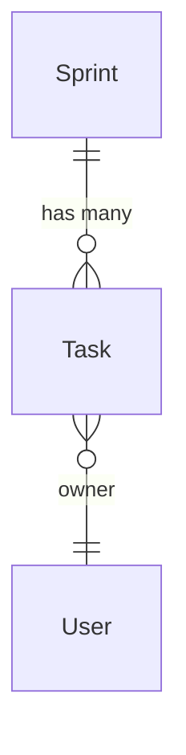

# Relationships & ER Diagram API

Complete API reference for Relationship and ErDiagram.

## Relationship

Custom (non-ORM) relationship declaration.

```python
from sqlmodel_nexus import Relationship

class Task(SQLModel, table=True):
    __relationships__ = [
        Relationship(
            fk="id",
            target=list[Tag],
            name="tags",
            loader=tags_loader,
        )
    ]
```

### Parameters

| Parameter | Type | Required | Description |
|-----------|------|----------|-------------|
| `fk` | `str` | Yes | Field name on the source entity used by DataLoader to collect key values |
| `target` | `type` | Yes | Target type (`Entity` or `list[Entity]`) |
| `name` | `str` | Yes | Relationship name, used for implicit auto-loading matching |
| `loader` | `type` or `callable` | Yes | DataLoader class or async batch function |

### Declaration Location

Declare in the `__relationships__` class attribute of a SQLModel entity class, as a list of `Relationship` instances.

### target Syntax

```python
# Single target (MANYTOONE)
Relationship(fk="owner_id", target=User, name="owner", loader=user_loader)

# List target (ONETOMANY)
Relationship(fk="id", target=list[Tag], name="tags", loader=tags_loader)
```

## ErDiagram

Mermaid ER diagram generation.

```python
from sqlmodel_nexus import ErDiagram

diagram = ErDiagram(entities=[Sprint, Task, User])
```

### Methods

| Method | Signature | Description |
|--------|-----------|-------------|
| `get_diagram()` | `-> str` | Generate a Mermaid ER diagram string |
| `get_all_entities()` | `-> list` | Get all registered entities |
| `get_all_relationships()` | `-> list` | Get all registered relationships |

### Mermaid Output Example



### From ErManager

```python
er = ErManager(base=SQLModel, session_factory=async_session)
diagram = er.get_diagram()
print(diagram.get_diagram())
```
