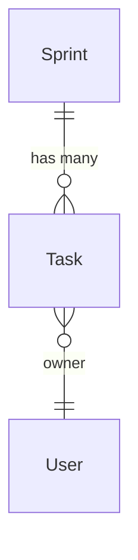

# 关系与 ER 图 API

Relationship 和 ErDiagram 的完整 API 参考。

## Relationship

使用 `Relationship` 声明自定义（非 ORM）关系。

```python
from nexusx import Relationship

class Task(SQLModel, table=True):
    __relationships__ = [
        Relationship(
            fk="id",
            target=list[Tag],
            name="tags",
            loader=tags_loader,
        )
    ]
```

### 参数

| 参数 | 类型 | 必选 | 说明 |
|------|------|------|------|
| `fk` | `str` | 是 | 源实体上用于 DataLoader 收集键值的字段名 |
| `target` | `type` | 是 | 目标类型（`Entity` 或 `list[Entity]`） |
| `name` | `str` | 是 | 关系名称，用于隐式自动加载匹配 |
| `loader` | `type` or `callable` | 是 | DataLoader 类或异步批量函数 |

### 声明位置

在 SQLModel 实体类的 `__relationships__` 类属性中声明，值为 `Relationship` 实例列表。

### target 语法

!!! tip
    使用 `target=Entity` 表示 MANYTOONE 关系（单个目标），使用 `target=list[Entity]` 表示 ONETOMANY 关系（列表目标）。

```python
# 单个目标（MANYTOONE）
Relationship(fk="owner_id", target=User, name="owner", loader=user_loader)

# 列表目标（ONETOMANY）
Relationship(fk="id", target=list[Tag], name="tags", loader=tags_loader)
```

!!! tip
    确保关系名称与字段名称匹配，以便启用隐式自动加载。如果字段名为 `owner`，关系名称也应为 `owner`。

## ErDiagram

使用 `ErDiagram` 生成 Mermaid ER 图。

```python
from nexusx import ErDiagram

diagram = ErDiagram(entities=[Sprint, Task, User])
```

### 方法

| 方法 | 签名 | 说明 |
|------|------|------|
| `get_diagram()` | `-> str` | 生成 Mermaid ER 图字符串 |
| `get_all_entities()` | `-> list` | 获取所有已注册实体 |
| `get_all_relationships()` | `-> list` | 获取所有已注册关系 |

### Mermaid 输出示例



### 从 ErManager 获取

```python
er = ErManager(base=SQLModel, session_factory=async_session)
diagram = er.get_diagram()
print(diagram.get_diagram())
```
