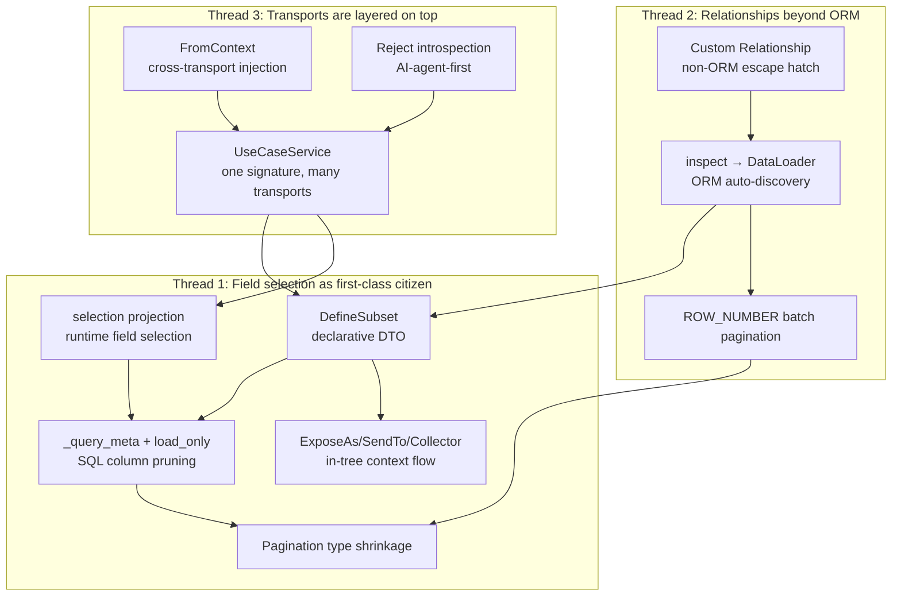

# nexusx Design Highlights: 12 Differentiated Decisions Excavated From the Code

> This article is not a tutorial. It's a vertical audit of the nexusx codebase: pulling out the design decisions that actually let it stand on its own next to Strawberry / FastAPI / FastMCP, and explaining for each one what problem it solves, how it works under the hood, why it's hard, and how nexusx resolves it.
>
> Audience: backend architects evaluating framework choices, contributors who want to understand the codebase, and engineers interested in "field selection as a general-purpose idea."

## TL;DR — Three Threads

Collapsing the 12 highlights in this article, nexusx's differentiation comes down to three sentences:

1. **"Field selection" is a first-class citizen** — from GraphQL selection to DefineSubset, to SQL column pruning and pagination type shrinkage, the same concept runs through four layers. Other frameworks treat "select fields on demand" as a GraphQL protocol feature; nexusx promotes it to a design principle that runs through the entire data flow.
2. **Relationships are not just ORM relationships** — `sqlalchemy.inspect` auto-discovery + `Relationship(...)` custom escape hatch + DataLoader batching + `ROW_NUMBER()` window-function pagination cover the full spectrum from pure ORM to external data sources. Your data-access layer no longer has to split into two worlds just because you encounter a Redis cache or search engine.
3. **Transports are layered on top, not baked in** — one `UseCaseService` + one method signature → GraphQL / REST / MCP / CLI, glued together by a metaclass + `FromContext` + selection triplet. Write the business method once; adding a transport is a configuration problem, not a code problem.

Below is the concrete support.

---

## Thread 1: Field Selection as a First-Class Citizen

### 1. `DefineSubset` — Moving GraphQL Field Selection Into the Python Type System

**Problem**: In traditional web frameworks, there are a few paths from ORM entity to API response, each with costs:

- Returning ORM entities directly → serialization exposes every column, leaking internal fields and providing no way to do derived computation;
- Hand-writing Pydantic DTOs → every API endpoint requires duplicating field definitions, ORM schema changes drift out of sync with DTOs;
- Inheriting from ORM entities for response variants → SQLModel / Pydantic inheritance semantics get murky around "which fields are table columns vs. serialization fields," and you can't express "I only want `name`, not `email`" type of on-demand shrinking.

GraphQL solves this with selection sets, but only inside the GraphQL path. REST handlers, background tasks, CLI commands — none benefit.

**How it works**: `DefineSubset` at `src/nexusx/subset.py:739` uses a metaclass (`SubsetMeta`) to perform a compile-time transformation when the class is created:

```python
class PostDTO(DefineSubset):
    __subset__ = (Post, ("id", "title", "author_id"))
    author: UserDTO | None = None     # field name matches relationship → auto-load
    full_title: str = ""

    def post_full_title(self, ancestor_context):
        return f"{ancestor_context['sprint_name']} / {self.title}"
```

The metaclass does three things:

1. **Reads the source entity and requested scalar columns from `__subset__ = (Entity, fields)`**, converting them to Pydantic field definitions. This step also validates: all column names must exist on the entity, and FK columns must be either in the allowlist or unused by relationship fields.
2. **Scans the class body for additional fields** (e.g. `author: UserDTO | None`). If the field name matches a relationship on the source entity, the resolver wires it to the corresponding DataLoader at execution time; if it's a new field (e.g. `full_title`), it becomes a "derived field" that must be populated by a `post_*` method.
3. **Extracts `resolve_*` and `post_*` methods** as lifecycle hooks. `resolve_*` runs before loader dispatch (can override default loading); `post_*` runs after nested data is ready (used for derived computation or aggregation).

The resulting `PostDTO` is a standard Pydantic BaseModel — it can be `model_dump()`-ed, validated by `TypeAdapter`, attached to a FastAPI endpoint as `response_model`. In other words, **it doesn't invent a new type system — it leans on Pydantic** — which is the key reason it stays compatible with the entire Python web ecosystem.

**Why it matters**: GraphQL is not the exclusive province of GraphQL frameworks. Strawberry's resolver machinery only serves GraphQL endpoints; if a REST handler wants "field selection + auto-loading," it has to fall back to hand-written DTOs. `DefineSubset` elevates this to a general posture of business code: the field declarations you write in `DefineSubset` are a "response contract" shared by REST / GraphQL / MCP. When a project needs both GraphQL's flexibility and REST's stability, the value is order-of-magnitude — it eliminates the entire workflow of "maintaining three field definitions for the same business entity across three protocols."

### 2. `ExposeAs` / `SendTo` / `Collector` — Bidirectional Context Flow Inside the DTO Tree

**Problem**: Consider a real requirement — "list the deduplicated owners of all tasks under a sprint as contributors." The three conventional approaches each have problems:

1. **Hand-written SQL subquery**: performant, but cross-database dialect issues (`DISTINCT ON` exists in Postgres but not MySQL), and tightly coupled to ORM session;
2. **Hang a method on `SprintDTO` that walks `self.tasks` collecting owners**: triggers lazy-loading of every task's owner → N+1;
3. **Pre-query contributors in the sprint business method**: works, but contributors logic is scattered between the business layer and the DTO assembly layer, and as soon as you need "contributors should also show per-contributor task count" you're recursing.

Fundamentally this is a **cross-layer data flow within a DTO tree** problem: information needs to flow both parent→child and child→parent, and it has to cooperate with DataLoader's batching (to avoid N+1).

**How it works**: `src/nexusx/context.py` provides three primitives:

```python
class SprintDTO(DefineSubset):
    __subset__ = (Sprint, ('id', 'name'))
    name: Annotated[str, ExposeAs('sprint_name')]   # broadcast downward
    tasks: list[TaskDTO] = []
    contributors: list[UserDTO] = []                 # container for upward aggregation

    def post_contributors(self, collector=Collector('contributors')):
        return collector.values()

class TaskDTO(DefineSubset):
    __subset__ = (Task, ('id', 'title'))
    owner: Annotated[UserDTO | None, SendTo('contributors')] = None  # push upward
```

The resolver walks the tree twice:

- **First pass (downward)**: once `SprintDTO.name` is loaded, its value is placed into an `ancestor_context` dict (keyed by the `ExposeAs` alias) and propagated to all descendant nodes. `TaskDTO.post_full_title(self, ancestor_context)` can then read `ancestor_context['sprint_name']`. This context is **read-only broadcast** — children cannot mutate parent values, avoiding side effects.
- **Second pass (upward)**: once `TaskDTO.owner` is loaded, the resolver checks whether it carries a `SendTo('contributors')` annotation, and if so, pushes the value into the nearest ancestor's `'contributors'` `Collector`. `Collector.add` defaults to append; `flat=True` switches to extend (for list fields). `SprintDTO.post_contributors` is invoked after the entire subtree has run, pulling the pre-dedup list from `collector.values()` (dedup itself happens at the loader layer — the same `User` only gets queried once).

`scan_expose_fields` and `scan_send_to_fields` use class-level caches (`_expose_cache` / `_send_to_cache`) to avoid re-scanning annotations on every request. `SendTo` accepts a tuple (`SendTo(('a', 'b'))`) so a single value can fan out to multiple collectors — useful when the same data feeds multiple aggregations.

**Why it matters**: This pattern has essentially no equivalent in other Python GraphQL / DTO frameworks. GraphQL itself has `@parent` and context mechanisms, but they live inside GraphQL execution and don't escape to other layers; Pydantic's `model_validator` can only run inside a single model. The true value of `ExposeAs` / `SendTo` / `Collector` is **treating the DTO tree as a directed acyclic graph supporting limited data flow between parent and child** — neither unrestricted shared state (hard to debug) nor complete isolation (which forces you back to hand-written SQL). This "controlled bidirectional flow" is nexusx's core abstraction for tree-shaped response assembly; almost any "derived from subtree" field can be expressed elegantly with it. Code that used to take 30-50 lines of hand-rolled aggregation + dedup + batch loading now collapses to 3 lines of annotation.

### 3. `selection` Projection — Reusing GraphQL Field Syntax on Arbitrary Python Function Returns

**Problem**: GraphQL solved "the client tells the server which fields it wants," but that capability is locked inside the GraphQL protocol. A normal Python function (say, the return value of a UseCase method) has no such "trim on demand" capability — either the method returns the full object (bandwidth and serialization cost), or you write a variant per caller (method explosion).

MCP sharpens this problem: when an LLM calls a tool, it often only needs 10% of the return value (e.g. "list the sprint names and ids, no task details"), but the tool signature is fixed — the LLM has to take the full payload and trim it itself, wasting tokens and inflating prompt complexity.

**How it works**: `apply_selection` in `src/nexusx/use_case/selection.py` brings GraphQL-style field projection to any Python function return:

```python
result = await SprintService.list_sprints()  # returns list[SprintDTO] with full fields

# Caller passes a GraphQL-style selection string
pruned = apply_selection(
    result,
    return_annotation=list[SprintDTO],
    selection="id name tasks { title }",
)
```

Four steps:

1. **Parse selection**: `QueryParser` wraps `"id name tasks { title }"` as `{ __result: ... }` and parses it into a `FieldSelection` tree — **exactly the same code path** as GraphQL query parsing. Nothing is reinvented.
2. **Extract root model from return type annotation**: `_extract_root_model` handles container types like `list[X]` / `X | None` / `dict[K, V]`, ultimately returning a Pydantic BaseModel subclass.
3. **Build subset model dynamically**: `build_subset_model` recursively `pydantic.create_model`s a brand-new type containing only the requested fields, based on `FieldSelection`. Nested relationship fields recurse. Arguments (like GraphQL `limit`/`offset`) are explicitly rejected (`_reject_arguments`) — this is the semantic difference between UseCase and GraphQL paths: the former only projects, never re-queries.
4. **TypeAdapter projection**: the new model's `TypeAdapter.validate_python(result)` runs a Pydantic validation pass; the result is the trimmed subset.

**Why it matters**: This is the most direct expression of nexusx's internal coherence. **The same field-selection syntax** is reused across three execution paths: the GraphQL protocol layer (client → server), the DefineSubset declarative layer (developer writing code), and the selection runtime projection layer (caller dynamically trimming). This means a developer who has learned to write GraphQL selections automatically knows how to write DefineSubset and how to use MCP `selection` — zero extra mental cost. Architecturally, this "same concept reused across layers" is the fundamental feature that distinguishes nexusx from "a pile of loosely coupled features stitched into a framework." For MCP, it directly solves the "LLM wastes tokens on fields it doesn't care about" pain point — the LLM just adds a `selection` parameter to a tool call and controls the response precisely, like writing GraphQL.

### 4. Column Pruning (`_query_meta` + `load_only`) — Selection Sinks All the Way to SQL

**Problem**: DataLoader solves N+1 (batch-fetching children of N parents in one query), but by default each batch is `SELECT *` — even if the caller only cares about 3 columns. On wide tables (e.g. a 50-column entity) under high concurrency, the I/O and deserialization overhead of redundant columns is significant.

The harder part: the same loader instance may be reused by multiple consumers within a request. For example, `User.posts` may be requested by both `PostSummary` (only wants `title`) and `PostDetail` (wants `title + content + author_id + created_at`). If you prune to the minimum set per consumer, the other consumer hits AttributeError; if you `SELECT *`, you're back to square one.

**How it works**: `src/nexusx/loader/query_meta.py` + `factories.py:_apply_load_only` sink field selection all the way to SQL:

1. **Generate `_query_meta`**: `generate_query_meta_from_dto(dto_class)` scans response-model fields and lists every field name corresponding to a SQL column; `generate_query_meta_from_selection` does the same from a GraphQL FieldSelection, **preserving FK columns** — even if the caller didn't explicitly select the FK, the next-level relationship still needs it as a batch key.
2. **Attach to loader instance**: `merge_query_meta(loader, meta)` merges metadata into the loader's `_query_meta` attribute. The merge is a **field union**, ensuring every consumer's needed columns are present.
3. **Translate inside `batch_load_fn`**: `_get_effective_query_fields` reads `_query_meta`, and `_apply_load_only` translates the field list into SQLAlchemy's `load_only(*cols)`:

```python
SELECT post.id, post.title, post.author_id FROM post WHERE post.author_id IN (1, 2, 3)
# instead of SELECT * FROM post WHERE post.author_id IN (1, 2, 3)
```

**Why it matters**: Most "ORM + GraphQL" frameworks either `SELECT *` (Strawberry's default behavior) or force you to hand-write `load_only` per resolver (and risk conflicts with other resolvers). nexusx makes pruning completely transparent through reverse inference + union merging — you only declare the fields you want in `DefineSubset`, and SQL only queries those columns; when multiple DTOs share a loader, the union prevents over-pruning. Performance-wise, fetching 5 of 50 columns typically saves 90% bandwidth; more importantly, the database buffer-pool hit rate improves significantly (smaller rows → more rows in buffer), a multiplier effect that applies to every query. This "selection shrinks throughout" design is the key thing distinguishing nexusx from other Python GraphQL frameworks on the performance axis.

### 5. Pagination Type Shrinks with Selection

**Problem**: A GraphQL pagination response usually looks like:

```graphql
type PostResult {
  items: [Post!]!
  pagination: Pagination!
}
type Pagination {
  has_more: Boolean!
  total_count: Int
}
```

But `total_count` requires `COUNT(*)`, which on a million-row table can be an order of magnitude slower than the LIMIT query itself. If the caller never asked for `total_count`, computing it is pure waste.

**How it works**: `create_result_type` in `src/nexusx/loader/pagination.py` doesn't generate a fixed full `Pagination` type — it shrinks dynamically based on selection:

```python
def create_result_type(item_type, pagination_selection=None):
    fields = {"items": (list[item_type], ...)}
    if pagination_selection:
        pag_model = _build_pagination_model(pagination_selection)
        fields["pagination"] = (pag_model, ...)
    return create_model(...)
```

`_build_pagination_model` only includes fields that actually appear in the selection (`has_more` / `total_count`) in the dynamically generated Pydantic model. Downstream, `create_page_one_to_many_loader` reads this shrunk schema when running SQL: if `total_count` isn't in the response model, `COUNT(*)` is skipped entirely — only `has_more` is computed (via the `LIMIT + 1` trick).

**Why it matters**: This is the pagination-specific case of item 4's "selection shrinks throughout," but called out separately because pagination is a high-sensitivity area for GraphQL performance. Standard GraphQL Relay pagination defaults to computing cursor + total_count + has_previous_page + has_next_page — each potentially a separate SQL. Many frameworks, by not distinguishing "what the caller asked" from "what the protocol mandates," end up with pagination metadata overhead exceeding the actual data. nexusx makes metadata computation follow selection too — this is "field selection as first-class citizen" fully implemented in engineering: any field not requested should not appear, from Pydantic model down to SQL.

---

## Thread 2: Relationships Beyond ORM

### 6. Auto-Generating DataLoaders from SQLAlchemy Metadata

**Problem**: DataLoader is GraphQL's standard weapon against N+1. But DataLoader is tedious to use:

- Every relationship requires a hand-written loader class (subclass `aiodataloader.DataLoader`, implement `batch_load_fn`);
- Every resolver must manually fetch the corresponding loader from `context`, call `.load(key)`;
- Batch-key design, SQL construction, the `IN (...)` clause — repeated for every loader;
- Many-to-many requires handling the association table, much more complex than one-to-many.

Strawberry's documentation devotes considerable space to this, and every relationship is a chunk of boilerplate.

**How it works**: `ErManager` in `src/nexusx/loader/registry.py` does three things at startup:

1. **`_inspect_relationships(entity, all_entities, session_factory)`** uses `sqlalchemy.inspect(entity)` to read all relationships from the ORM mapper, classifying direction into `MANYTOONE` / `ONETOMANY` / `MANYTOMANY`, extracting FK column, target entity, and list-ness.
2. **Invoke the matching factory** (`factories.py`) per direction:
   - `create_many_to_one_loader`: batch key is the child entity's FK column values; SQL is `SELECT * FROM child WHERE child.fk IN (...)`; results grouped by FK and returned per key.
   - `create_one_to_many_loader`: batch key is parent PKs; SQL is `SELECT * FROM child WHERE child.parent_id IN (...)`; results grouped by parent_id.
   - `create_many_to_many_loader`: an additional association-table step — first `SELECT * FROM association WHERE ... IN (...)` to get pairs, then batch-fetch target entities.
3. **Register in `self._registry`**: a `dict[type[SQLModel], dict[str, RelationshipInfo]]`. At runtime, lookup via `entity → rel_name → loader_cls`; each loader instance is cached per request scope (`get_loader` creates `loader_cls()` on first call and reuses it for the rest of the request).

The user participates in none of this. Once entities are defined, relationships are queryable — `Sprint.tasks`, `Task.owner`, `User.posts` require zero resolver lines.

**Why it matters**: This is the fulfillment of the "write SQLModel classes, done" promise. Compare Strawberry's typical usage — every relationship needs `@strawberry.field(resolver=lambda ...) → context.loader.load(...)`; a 10-entity project might need 30-50 resolvers, each a similar boilerplate chunk. nexusx dissolves all this via ORM metadata reflection. Code volume drops from "entity-count × relationship-count × several lines" to "0." More importantly, **reflection accuracy** — SQLAlchemy's relationship metadata is well-considered (supporting `back_populates`, `secondary`, `viewonly`, `cascade`, etc.), and nexusx reuses its semantics rather than reinventing them, meaning all SQLAlchemy user knowledge and intuition transfers directly. This is engineering discipline of "don't reinvent the wheel."

### 7. Non-ORM Custom `Relationship` — The Escape Hatch That Doesn't Tie You to SQLAlchemy

**Problem**: No matter how good reflection gets in item 6, it can only cover relationships expressible as SQLAlchemy `Relationship(...)`. Real-world business has many relationships outside this scope:

- **Cross-store**: "User's recently viewed articles" lives in Redis, not a database table;
- **Derived**: "Articles relevant to me" may require querying Elasticsearch;
- **Aggregated**: "Sprint contributors" requires joining task + user and deduplicating, but you want to express it as a database view or materialized view;
- **External API**: pulling data from third-party services.

In these scenarios, the conventional approach is to hand-write "query entity first, then augment fields" in the business layer, splitting code into "ORM data + manual stitching." Result: these fields miss out on DataLoader, can't use DefineSubset, get no representation in ER diagrams.

**How it works**: `Relationship` at `src/nexusx/relationship.py:38` is a first-class construct that abstracts "relationship" from "ORM metadata" into "an async batch function":

```python
async def tags_by_post_id_loader(post_ids: list[int]) -> list[list[Tag]]:
    # Redis / ES / external API — anything, as long as it's a batch interface
    redis_keys = [f"post:{pid}:tags" for pid in post_ids]
    results = await redis.mget(redis_keys)
    return [parse_tags(r) for r in results]

class Post(SQLModel, table=True):
    __tablename__ = "post"
    __relationships__ = [
        Relationship(
            fk='id',                    # use post.id as batch key
            target=list[Tag],           # one-to-many
            name='tags',                # relationship name
            loader=tags_by_post_id_loader,
        ),
    ]
    id: int | None = Field(default=None, primary_key=True)
    title: str
```

`ErManager.__init__`, after reflecting ORM relationships, calls `get_custom_relationships(entity)` to read the `__relationships__` list, wraps each `Relationship` into a `RelationshipInfo` (with `direction='CUSTOM'`), and inserts it into the same registry. **Note the registry doesn't distinguish ORM from custom relationships** — downstream loader / resolver / DefineSubset / ER diagram all treat it as a first-class relationship.

The `Relationship` contract is determined by the `target` type:

- Scalar target (`target=User`): loader signature `async def fn(keys: list[K]) -> list[V | None]`, one-to-one return per key;
- List target (`target=list[Tag]`): loader signature `async def fn(keys: list[K]) -> list[list[V]]`, returns sub-list per key.

At startup `ErManager` validates name uniqueness (`rel.name in entity_rels → raise`), preventing a custom relationship from silently overriding an ORM relationship.

**Why it matters**: This is one of nexusx's most underappreciated designs. It resolves a fundamental framework dilemma: **a framework either leans hard on ORM (gaining reflection convenience but becoming tied down) or stays ORM-agnostic (flexible but requiring hand-written everything)**. By abstracting "relationship" from "ORM relationship metadata" into "a batch function," nexusx lets both sides share the same infrastructure — DefineSubset can select custom fields, DataLoader can batch-load them, ER diagrams visualize them, selection projects them. The elegance of this abstraction: batch loading is fundamentally a function `list[K] → list[V]`; ORM is just one implementation of that function. Strawberry / FastAPI in this scenario can only bypass the framework and hand-write — effectively excommunicating this code from the framework's jurisdiction.

### 8. `ROW_NUMBER() OVER (PARTITION BY ...)` Batch Pagination

**Problem**: One-to-many relationships with pagination, naively, become N independent `LIMIT` queries:

```sql
SELECT * FROM post WHERE author_id = 1 ORDER BY id LIMIT 3;   -- parent 1
SELECT * FROM post WHERE author_id = 2 ORDER BY id LIMIT 3;   -- parent 2
SELECT * FROM post WHERE author_id = 3 ORDER BY id LIMIT 3;   -- parent 3
-- ... N parents → N round-trips
```

This is nearly catastrophic in nested GraphQL pagination — a 5-level-deep query tree with 10 parents per level means N+1 at every level. Some frameworks do application-level batching (one `IN` query for everything, then in-memory grouping + trimming), but that pulls all data into the app layer, defeating pagination's purpose; and `has_more` / `total_count` still need separate queries.

**How it works**: `create_page_one_to_many_loader` in `src/nexusx/loader/factories.py` uses a window function to achieve "N items per parent in one SQL":

```sql
SELECT * FROM (
  SELECT *,
    ROW_NUMBER() OVER (PARTITION BY author_id ORDER BY id) AS _rn,
    COUNT(*) OVER (PARTITION BY author_id) AS _total
  FROM post
  WHERE author_id IN (1, 2, 3, ...)
) AS t
WHERE _rn BETWEEN :offset + 1 AND :offset + :limit
```

One round-trip yields:

- Each parent's current-page items (`_rn BETWEEN ...` filter);
- `total_count` (`COUNT(*) OVER (PARTITION BY ...)` computed);
- `has_more` (true when `_rn <= _offset + _limit` but `_total > _offset + _limit`).

Many-to-many (`create_page_many_to_many_loader`) adds a layer: first batch-query the association table for `(parent_id, child_id)` pairs, then window-function pagination, then batch-fetch child details. The entire flow happens in SQL; the application layer only assembles.

`PageArgs` (`pagination.py:24`) validates arguments in `__post_init__` (`limit >= 0`, `offset >= 0`, `max_page_size` cap); `effective_limit` uses `min(limit, max_page_size)` to defend against malicious large pages.

**Why it matters**: This is the production-grade GraphQL pagination pattern (cf. Shopify's / GitHub's Relay cursor mode internals), but in the Python ecosystem, few frameworks auto-wire it from ORM metadata and share the same abstraction with regular loaders. Its value scales exponentially in nested pagination scenarios: 3-level nesting, 20 parents per level, 5 items per page — naive N+1 is 20×20×20 = 8000 queries; the window-function approach is 3 (one per level). Even ignoring query count, single round-trip means more stable tail latency — which often matters more to SLOs than average latency. Combined with item 5's Pagination type shrinking, nexusx's pagination hits production-grade on all three dimensions of "response correctness + performance + protocol conformance."

### 9. Auto-Generated Standard Queries — Entities Sprout `by_id` / `by_filter` for Free

**Problem**: CRUD is 80% of backend work, yet every entity needs the same boilerplate hand-written: "query by PK, filter by field, sort, paginate." In a typical FastAPI + SQLModel project, every entity has a router file, every endpoint a chunk of `select(Entity).where(...)` — high cost to write and maintain. Django DRF solves part of this with ModelViewSet + FilterSet, but ties you to Django; other frameworks either don't solve it, or use code generators (heavy).

**How it works**: `src/nexusx/standard_queries.py` uses `AutoQueryConfig` to auto-generate two query types per entity:

1. **`<entity>by_id`** (`_create_by_id_query`): reads PK columns from the entity (`_get_primary_key_fields` handles single PK, composite PK), generates a GraphQL query field with signature `(id: ID!)` returning a single entity.
2. **`<entity>by_filter`** (`_create_by_filter_query`): dynamically `pydantic.create_model`s a filter input type, each scalar column becoming an optional filter field supporting `=` comparison; returns `list[Entity]` with `limit` / `offset`.

```python
class AutoQueryConfig:
    def __init__(
        self,
        session_factory,
        default_limit: int = 10,
        generate_by_id: bool = True,
        generate_by_filter: bool = True,
    ):
        ...
```

`add_standard_queries` registers the generated methods on the entity at schema-build time, with the `@query` decorator — downstream SDL generation treats them like any other `@query` method. The generated queries also go through the DataLoader path — only scalar columns loaded, relationship fields lazy-loaded per selection, enjoying all the benefits of column pruning and batch pagination.

**Why it matters**: Eliminates the "hand-write get_by_id for every table" boilerplate. A 20-entity project that used to need 20×3 = 60 endpoints (by_id, by_filter, list) now needs 0 lines of code. But more importantly, **it doesn't over-complicate simple problems**: when the auto-generated query doesn't fit (e.g. needs join, permission filter, complex sort), just write a `@query` method — auto queries and hand-written queries coexist. `generate_by_id=False` turns off one direction to avoid exposing unwanted schema entries. This "default-on + can-disable + doesn't block hand-written" design is more sustainable than "generate everything; modifying means modifying the generator."

---

## Thread 3: Transports Are Layered On Top

### 10. One `UseCaseService` Simultaneously Generates GraphQL / REST / MCP / CLI

**Problem**: Modern backend services often serve multiple client types simultaneously:

- **Web frontend**: REST + OpenAPI (mature toolchain, cache-friendly);
- **Mobile**: REST or GraphQL (team preference);
- **Third-party integrations**: GraphQL (flexible) or REST (standard);
- **AI agents**: MCP (Anthropic's tool protocol);
- **Ops**: CLI (scripting).

The conventional approach is one codebase per protocol: FastAPI for REST, Strawberry for GraphQL, FastMCP for MCP tools, Click for CLI. The same business method ("list the current user's sprints") is implemented 4 times, with auth, validation, and error handling scattered across 4 codebases; changing business logic means synchronizing 4 places.

**How it works**: `UseCaseService` at `src/nexusx/use_case/business.py:122` + the `BusinessMeta` metaclass decouple business-method definition from protocol translation:

```python
class SprintService(UseCaseService):
    @query
    async def list_sprints(cls, limit: int = 10) -> list[SprintSummary]:
        """Get all sprints with task counts."""
        ...

    @mutation
    async def create_sprint(cls, name: str) -> SprintSummary:
        """Create a new sprint."""
        ...

config = UseCaseAppConfig(name="project", services=[SprintService])

# Same config → four transports
mcp = create_use_case_graphql_mcp_server(apps=[config])
app.include_router(create_use_case_router(config))
graphql_handler = create_use_case_graphql_handler(config)
cli = build_cli(config)
```

Underlying mechanism:

1. **`BusinessMeta` metaclass** (`business.py:60`) scans the class body at class creation, collecting all `@query` / `@mutation`-decorated classmethods into `_business_methods`. This step is discovery only — the metaclass is unaware of and indifferent to protocols.
2. **One builder per protocol**:
   - `compose_schema.py`: scans `_business_methods`, combining method signature (`inspect.signature`) + return-type annotation (`get_type_hints`) into a GraphQL schema (`dict[str, TypeInfo]`, see item 13);
   - `router.py:create_router`: scans methods the same way, translating to a FastAPI router where each method becomes a POST endpoint;
   - `compose_mcp_server.py`: translates into MCP tool definitions where each method becomes a callable tool;
   - `cli.py:build_cli`: translates into Click/Typer-style CLI commands.
3. **Protocol-shared parts**: argument resolution (`FromContext`), response projection (selection), error model (`errors.py`), type mapping (`compose_type_mapper.py`) are all protocol-agnostic and reused by all four builders.

A comment in `compose_executor.py` makes a key design explicit: **"The executor does NOT wrap results in Resolver()"**. The GraphQL execution path doesn't auto-apply DTO assembly — if a method wants DefineSubset / Collector capabilities, it calls `Resolver().resolve(dtos)` in its own body. This is single responsibility: the executor only schedules methods + projects selection; DTO assembly is the business method's job.

**Why it matters**: Write the business method once; adding a transport is a configuration problem. This is an order-of-magnitude improvement to a project's evolution capability:

- Adding a new protocol (e.g. gRPC): write a new builder, zero business-code changes;
- Cross-protocol consistency: argument schemas, error codes, and documentation are inherently in sync because they all generate from the same method signature;
- Test tiering: business methods are independently unit-testable (no protocol dependency); protocol layers only test translation correctness.

Compare to a typical FastAPI project — one codebase per protocol, changes require synchronizing multiple files, behavior drifts across protocols — nexusx's "single source of truth" advantage scales linearly with the number of transports and entities. This is Clean Architecture's "delivery-independence" actually implemented in engineering, not停留在 PPT 的口号.

### 11. `FromContext` — Same Signature, Cross-Transport Parameter Injection

**Problem**: Business methods often need parameters that are "not in the protocol, but needed at execution time":

- `user_id` (decoded from JWT, the client cannot forge it);
- `tenant_id` (multi-tenant system);
- `request_id` (tracing);
- `db_session` (transaction boundary).

The trouble with these parameters:

- **GraphQL path**: should not appear in schema (otherwise clients could pass arbitrary user_id);
- **REST path**: must be decoded from header / cookie / token — every endpoint repeats `Depends(get_current_user)`;
- **MCP path**: must be decoded from MCP context (headers / session metadata);
- **CLI path**: from `--user-id` arguments or environment variables.

The conventional approach is to rewrite extraction logic per endpoint, or stuff a `request` parameter into the business method (leaking protocol details into the business layer).

**How it works**: `FromContext` in `src/nexusx/use_case/context.py` marks a parameter as "cross-transport injected":

```python
from typing import Annotated
from nexusx.use_case import UseCaseService, FromContext

class TaskService(UseCaseService):
    @query
    async def my_tasks(cls,
                      user_id: Annotated[int, FromContext()],
                      limit: int = 10) -> list[TaskDTO]:
        return await Resolver().resolve(
            await get_tasks_by_user(user_id, limit)
        )
```

Each transport injects in its own way:

- **GraphQL / MCP**: upon detecting `FromContext` via `is_from_context_annotation`, the parameter is **not exposed in schema** (`is_from_context=True` in `compose_type_mapper.py`); at execution, the value comes from `context_extractor(request) -> {"user_id": ...}` (`_build_kwargs` in `compose_executor.py`);
- **FastAPI**: `_make_context_extractor_dep` in `router.py` wraps `context_extractor` as a FastAPI Depends, decoding the context dict from the `Request` object, then dispatching to corresponding parameters;
- **CLI**: `cli.py` maps `FromContext` parameters to `--user-id` command-line options or environment variables.

`context_extractor` is a user-supplied callback with signature `(request) -> dict | Awaitable[dict]`, attached at config level:

```python
UseCaseAppConfig(
    name="project",
    services=[TaskService],
    context_extractor=lambda req: {"user_id": decode_jwt(req.headers["Authorization"])},
)
```

**Why it matters**: The signature is a single source of truth. Cross-cutting concerns like auth, tenant context, and tracing used to require rewriting extraction logic per endpoint — a 30-endpoint project might write `Depends(get_current_user)` 30 times, each handling token parsing, error responses, user-object loading. `FromContext` reduces this to one annotation on the method signature + one callback at config level. More importantly, it **preserves business-method purity**: the business method sees only `user_id: int`, unaware whether the value came from JWT, cookie, API key, or CLI argument — this is the precise implementation of Clean Architecture's "business logic doesn't depend on delivery details." When a project migrates from single-tenant to multi-tenant, from session auth to JWT, from HTTP to gRPC, the business methods change zero lines.

### 12. UseCase Path Explicitly Rejects GraphQL Introspection — AI-Agent-First Design

**Problem**: One of GraphQL's signature capabilities is introspection — clients query `__schema` to get the entire schema; tools (GraphiQL, Apollo Studio) depend on it for autocomplete and docs. But for LLM agents, introspection is a disaster:

- **Token cost**: a project with 30 services × 5 methods per service may have a `__schema` JSON output exceeding 50K tokens, carried on every conversation;
- **Cognitive load**: LLM accuracy finding "which method should I call" inside a giant schema is far lower than calling a structured discovery tool;
- **Cache friendliness**: introspection response is constant but transmitted every time, wasting the "hot" portion of the context window.

MCP's design philosophy is "tool interfaces specifically optimized for LLMs," but many GraphQL-via-MCP solutions just forward the GraphQL endpoint, letting the LLM run introspection queries — inheriting GraphQL's problems wholesale.

**How it works**: `src/nexusx/use_case/compose_executor.py` actively rejects introspection and provides dedicated discovery tools:

```python
_INTROSPECTION_REJECTION_HINT = (
    "GraphQL introspection is not available via compose_query. "
    "Use describe_compose_schema(app_name=...) and "
    "describe_compose_method(app_name=..., service_name=..., method_name=...) "
    "to discover the schema."
)
```

Implementation in two steps:

1. **AST-level detection**: `_document_uses_introspection` walks the GraphQL AST before execution; any `__schema` / `__type` / `__typename` field triggers rejection **before method dispatch**. This avoids "dispatch first, fail later" side effects.
2. **Dedicated discovery tools**: `describe_compose_schema(app_name)` returns a compact service/method list (one line per method: description + parameter schema + return type); `describe_compose_method(...)` returns detailed schema for a single method. LLMs can discover in stages: `describe_compose_schema` for the overview, then `describe_compose_method` for methods of interest.

`describe_compose_schema`'s output is 5-10x more compact than GraphQL introspection — stripping type-system meta-info (kind, of_type nesting, etc.) and keeping only what's actually useful to the LLM: "what's this method called, what parameters, what return."

**Why it matters**: This is anti-GraphQL-textbook but consistent with MCP philosophy. In the "human developer using an IDE to write queries" scenario, introspection + GraphiQL is irreplaceable DX; in the "LLM agent using tools to complete tasks" scenario, a giant schema is a burden. nexusx separates the two: the GraphQL path (`GraphQLHandler`) preserves full introspection for humans; the UseCase / MCP path (`compose_query`) rejects introspection for agents. This "same framework, different protocols, different optimization targets"精细化设计 is the genuine expression of nexusx treating AI agents as first-class citizens, rather than "wrapping GraphQL in a layer of MCP and calling it MCP support." For teams actually building agents with nexusx, this decision translates directly to lower token costs and higher LLM call accuracy — both core KPIs in production agent systems.

---

## Supporting Engineering: Less Visible but Critical Decisions

### 13. Custom Schema Registry — Not Using graphql-core's `GraphQLSchema` Directly

**How it works**: The GraphQL schema is modeled as `dict[str, TypeInfo]` (`compose_schema.py`); each `TypeInfo` is a frozen + slotted dataclass whose structure is isomorphic to the graphql introspection `__schema` payload. `render_introspection()` converts this internal representation to introspection JSON; the result round-trips through `graphql.utilities.build_client_schema(...)` and feeds GraphiQL. `IntrospectionGenerator` (`introspection.py:24`) follows a similar path, generating introspection JSON directly from entities + methods, **without going through graphql-core's `GraphQLSchema`**.

**Why it matters**: Three benefits: (1) avoids being tied to graphql-core's internal APIs — smaller migration surface when graphql-core upgrades (graphql-core 5.0 changed a number of internal interfaces); (2) UseCase / GraphQL / MCP share the same schema description, no triple conversion layer; (3) slotted dataclasses have smaller memory footprint and faster construction than graphql-core's `GraphQLObjectType` etc., helping both startup time and concurrency. This is a "we thought it through" architectural decision — usually invisible but every path benefits.

### 14. `split_loader_by_type` — Precise Isolation for Multi-Consumer Column Conflicts

**How it works**: By default, the same loader shares one global instance (`loader_cls → instance` in `get_loader`); when multiple consumers reuse it, `_query_meta` fields union (see item 4). But occasionally the same relationship in a tree is consumed by **different DTO types** with wildly different column needs — say `PostCardDTO` wants only `title` and `cover_url`, `PostDetailDTO` wants 12 columns — the union grows until SELECT is effectively back to `SELECT *`. `split_loader_by_type=True` switches to split mode, keying loader instances by `frozenset[fields]` as a second-level cache:

```python
# Default: {loader_cls: instance}
# Split:   {loader_cls: {frozenset[fields]: instance}}
def get_loader(self, loader_cls, type_key=None):
    if not self._split_mode or type_key is None:
        return self._loader_instances.setdefault(loader_cls, loader_cls())
    inner = self._loader_instances.setdefault(loader_cls, {})
    return inner.setdefault(type_key, loader_cls())
```

**Why it matters**: This is the precise solution to a niche but real scenario. Most projects don't need this switch (the default union mode is fine), but when "the same relationship appears in a response as multiple DTO variants" hits, split mode makes column pruning actually work rather than getting diluted by unions. The default-off embodies "don't pay complexity for non-existent needs," but it's there when needed.

### 15. Forward Reference / PEP 563 Handling

**How it works**: Correctly resolving types under `from __future__ import annotations` + SQLModel + Pydantic + `list["Post"]` + `int | None` mix is unglamorous work — invisible when present, breaking everything when absent. `_resolve_forward_reference` in `response_builder.py` handles string-form forward references; `_extract_entity_from_annotation` extracts entity types from complex annotations (`Optional[list[X]]` etc.). `_get_namespace_annotations` in `subset.py` even handles Python 3.14's behavior change — 3.14 in some cases sets `__annotations__` to None inside class body, requiring direct namespace reads.

**Why it matters**: Python type-annotation behavior is inconsistent across 3.10 / 3.11 / 3.12 / 3.13 / 3.14 — each version has its own edge cases. The quality of this "glue code beneath the framework skeleton" directly determines "does it run out of the box" — a project running fine on 3.10 may break on 3.12 due to runtime representation changes of `X | Y`. nexusx invests considerable code in this part (see `subset.py`'s multiple `_unwrap_*` / `_get_namespace_annotations` / `_extract_*` functions). This code isn't glamorous, but without it the framework wouldn't stand. It's a hidden indicator of engineering maturity.

---

## How the Highlights Relate



The three threads aren't independent: DefineSubset's `post_*` hooks reuse DataLoader (Threads 1 + 2); selection projection triggers column pruning on the UseCase path (Threads 1 + 3); custom Relationship also flows into DefineSubset (Threads 2 + 1). This "layers feeding each other" property is the fundamental reason nexusx-the-whole is greater than the sum of its parts.

---

## Comparison With Other Frameworks (Selected Dimensions)

| Dimension | nexusx | Strawberry | FastAPI + SQLModel | FastMCP |
|------|:---:|:---:|:---:|:---:|
| GraphQL field selection ←→ Python DTO | Consistent via `DefineSubset` | GraphQL-only | Hand-written | N/A |
| Auto relationship loading (no resolver) | ✓ inspect + custom | Hand-written resolver | — | — |
| N+1 prevention | ✓ DataLoader auto | Manual DataLoader wiring | — | — |
| SQL column pruning follows selection | ✓ `_query_meta` | — | — | — |
| Cross-layer context in DTO tree | ✓ ExposeAs/SendTo | — | — | — |
| Non-ORM relationships | ✓ `Relationship(...)` | — | — | — |
| Same signature → GraphQL+REST+MCP | ✓ UseCaseService | — | — | — |
| AI-agent-friendly schema discovery | ✓ Rejects introspection + discovery tools | — | — | Partial |

---

## For Contributors: Where to Invest Next

Several potential improvement directions I noticed during this audit (not "highlights" yet, but "next-to-shine"):

- **Item 4 (`_query_meta`) is currently a runtime union**: if selection → column-pruning inference were hoisted to schema-build time (for known selection sets), per-request merge overhead could be eliminated.
- **Item 7 (custom `Relationship`) integration with GraphQL schema generation**: how custom relationships get first-class representation in SDL / ER diagrams is currently under-documented.
- **Item 12 (introspection rejection) agent discovery tools**: could `describe_compose_method` further generate few-shot examples to help LLMs learn to call methods — an open problem in the MCP ecosystem.
- **Item 14 (`split_loader_by_type`) observability**: enabling split mode causes loader-instance count to explode with type_key combinations; monitoring metrics are needed.

---

## Closing

nexusx's true selling point isn't "yet another GraphQL library" or "yet another MCP framework," but **unifying three things that are usually separate — field selection, relational batch loading, and transport translation — into one programming model**. DefineSubset is the syntactic expression of this unity; `ExposeAs` / `SendTo` / `Collector` is its extension over tree structures; `UseCaseService` is its extension across transports.

If you're building a project that needs GraphQL's flexibility + REST's delivery + AI agent integration, the "don't rewrite" savings along these three dimensions is order-of-magnitude.

> **Related docs**
> - [Clean Architecture Comparison](./clean-architecture-comparison.md) — nexusx vs. Litestar / Django / Strawberry et al.
> - [Cross-Layer Data Flow API](./api/api_cross_layer.md) — `ExposeAs` / `SendTo` / `Collector` API reference
> - [How it works](https://github.com/allmonday/nexusx/blob/master/how_it_works.md) — full conversion logic and module deep-dive (in-repo)
