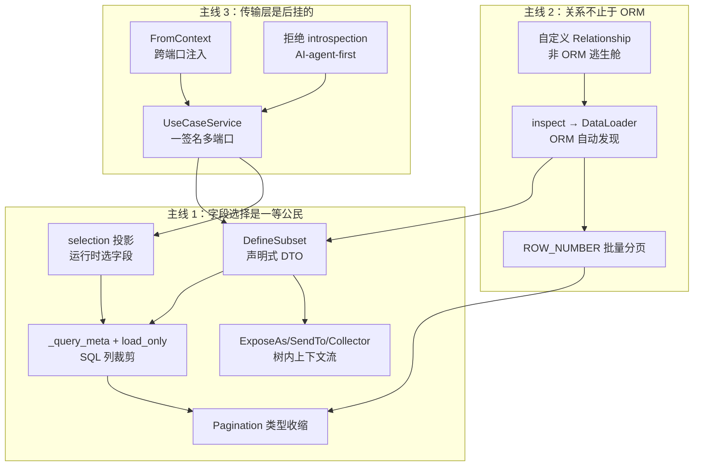

# nexusx 的设计亮点：从代码里挖出来的 12 个差异化决策

> 这篇文章不是 tutorial，而是一次对 nexusx 代码库的纵向巡检：把那些真正能让它在 Strawberry / FastAPI / FastMCP 之间立住脚的设计决策拎出来，说清楚每个决策解决的是什么问题、底层怎么实现的、为什么难、nexusx 怎么解的。
>
> 阅读对象：评估框架选型的后端架构师、想贡献代码的 contributor、对「字段选择作为一种通用思想」感兴趣的工程师。

## TL;DR — 三条主线

把全文 12 个亮点收敛起来，nexusx 的差异化可以用三句话讲完：

1. **「字段选择」是一等公民** —— 从 GraphQL selection 到 DefineSubset，再到 SQL 列裁剪和分页类型收缩，同一个概念贯穿四层。其他框架只把「按需选字段」当作 GraphQL 协议特性，nexusx 把它提升成贯穿整个数据流的设计原则。
2. **关系不止于 ORM** —— `sqlalchemy.inspect` 自动发现 + `Relationship(...)` 自定义逃生舱 + DataLoader 批量 + `ROW_NUMBER()` 窗口分页，覆盖了从纯 ORM 到外部数据源的全谱。这意味着你的数据访问层不会因为遇到一个 Redis 缓存或搜索引擎就被迫分裂成两个世界。
3. **传输层是后挂的** —— 一份 `UseCaseService` + 一份方法签名 → GraphQL / REST / MCP / CLI 四端口，靠 metaclass + `FromContext` + selection 三件套粘起来。业务方法写一遍，端口增加是配置问题不是代码问题。

下面是具体支撑。

---

## 第一条主线：字段选择作为一等公民

### 1. `DefineSubset` —— 把 GraphQL 字段选择搬进 Python 类型系统

**问题背景**：传统 Web 框架里，从 ORM 实体到 API 响应有几条路径，每条都有代价：

- 直接返回 ORM 实体 → 序列化时把所有列都暴露出去，既泄漏内部字段，也无法做派生计算；
- 手写 Pydantic DTO → 每加一个 API 端点都要复制一遍字段定义，ORM 改字段后 DTO 跟着改，drift 严重；
- 继承 ORM 实体做响应变体 → SQLModel / Pydantic 的继承语义在「哪些字段是表字段、哪些是序列化字段」上容易混淆，且无法表达「我只要 name，不要 email」这种按需收缩。

GraphQL 用 selection set 解决了这个问题，但只在 GraphQL 路径上有效。REST 处理器、后台任务、CLI 命令都享受不到。

**原理**：`src/nexusx/subset.py:739` 的 `DefineSubset` 通过 metaclass（`SubsetMeta`）在类创建时做了一次编译期变换：

```python
class PostDTO(DefineSubset):
    __subset__ = (Post, ("id", "title", "author_id"))
    author: UserDTO | None = None     # 字段名匹配关系 → 自动加载
    full_title: str = ""

    def post_full_title(self, ancestor_context):
        return f"{ancestor_context['sprint_name']} / {self.title}"
```

metaclass 做了三件事：

1. **从 `__subset__ = (Entity, fields)` 读出源实体和想要的标量列**，把它们转成 Pydantic 字段定义。这一步同时校验：所有列名必须在 entity 上存在、FK 列要么在白名单里要么不在白名单里不能被关系字段用到。
2. **扫描类体里的额外字段**（如 `author: UserDTO | None`），如果字段名匹配源实体的某个关系名，就在 resolver 执行时把它接到对应 DataLoader；如果是新字段（如 `full_title`），它就是「派生字段」，需要 `post_*` 方法填充。
3. **抽出 `resolve_*` 和 `post_*` 方法**作为生命周期钩子。`resolve_*` 在 loader 触发前运行（可用来覆盖默认加载），`post_*` 在嵌套数据就绪后运行（用来做派生计算或聚合）。

最终 `PostDTO` 是一个标准的 Pydantic BaseModel，可以正常 `model_dump()`、可以被 `TypeAdapter` 校验，可以挂在 FastAPI 端点的 `response_model` 上。换句话说，**它没有发明一种新的类型系统，而是借力 Pydantic**——这是它能和整个 Python Web 生态兼容的关键。

**这一项的意义**：GraphQL 不是 GraphQL 框架独占的能力。Strawberry 的 resolver 体系只服务于 GraphQL 端点，REST 处理器想享受「字段选择 + 自动加载」就得绕回手写 DTO。`DefineSubset` 把这件事提升成业务代码的通用姿态：你写在 `DefineSubset` 里的字段声明，就是一份可被 REST / GraphQL / MCP 三条路径共享的「响应契约」。当项目同时需要 GraphQL 的灵活性和 REST 的稳定性时，这件事的价值是数量级的——它消灭了「同一个业务实体在不同协议下维护三套字段定义」的整个工作流。

### 2. `ExposeAs` / `SendTo` / `Collector` —— DTO 树内的双向上下文流

**问题背景**：考虑一个真实需求——「一个 Sprint 下所有 Task 的 owner 去重后作为 contributors 列出来」。常规做法有三种，每种都有问题：

1. **手写 SQL 子查询**：性能好，但跨数据库方言（SQLite 的 `DISTINCT ON` 不存在于 MySQL），且和 ORM session 耦合；
2. **在 SprintDTO 上挂个方法，遍历 `self.tasks` 收集 `owner`**：会触发每个 task 的 owner 懒加载，N+1；
3. **在 sprint 业务方法里预先 query 出 contributors**：可行，但 contributors 的逻辑散落在业务层、和 DTO 装配层割裂，遇到「contributors 还要带每个 contributor 参与的 task 数」就又开始递归。

本质上这是一个 **DTO 树内跨层数据流**问题：信息需要在父→子和子→父两个方向流动，且要和 DataLoader 的批量加载协同（避免 N+1）。

**原理**：`src/nexusx/context.py` 提供了三个原语：

```python
class SprintDTO(DefineSubset):
    __subset__ = (Sprint, ('id', 'name'))
    name: Annotated[str, ExposeAs('sprint_name')]   # 向下广播
    tasks: list[TaskDTO] = []
    contributors: list[UserDTO] = []                 # 向上聚合的容器

    def post_contributors(self, collector=Collector('contributors')):
        return collector.values()

class TaskDTO(DefineSubset):
    __subset__ = (Task, ('id', 'title'))
    owner: Annotated[UserDTO | None, SendTo('contributors')] = None  # 上送
```

执行时 resolver 走两遍：

- **第一遍（下行）**：在 `SprintDTO.name` 加载完毕后，把它的值塞进一个 `ancestor_context` 字典（key 是 `ExposeAs` 的 alias），传给所有后代节点。`TaskDTO.post_full_title(self, ancestor_context)` 就能读到 `ancestor_context['sprint_name']`。这个上下文是**只读广播**——子节点改不了父节点的值，避免副作用。
- **第二遍（上行）**：在 `TaskDTO.owner` 加载完毕后，resolver 检查它是否带 `SendTo('contributors')` 注解，是的话把值塞进最近的祖先上名叫 `'contributors'` 的 `Collector`。`Collector.add` 默认是 append，`flat=True` 时是 extend（用于 list 字段）。`SprintDTO.post_contributors` 在所有子树都跑完后被调用，从 `collector.values()` 拿到去重前的列表（去重由 loader 层完成——同一个 User 只会查一次）。

`scan_expose_fields` 和 `scan_send_to_fields` 用类级别 cache（`_expose_cache` / `_send_to_cache`）避免每次请求重新扫注解。`SendTo` 支持元组（`SendTo(('a', 'b'))`）让一个值同时上送给多个 collector——这是为「同一份数据要进多个聚合」准备的。

**这一项的意义**：这个 pattern 在其他 Python GraphQL / DTO 框架里基本没有对应物。GraphQL 自身有 `@parent`、context 机制，但都是 GraphQL 执行层内部的事，跨不出去；Pydantic 的 model_validator 只能在单个模型内部跑。`ExposeAs` / `SendTo` / `Collector` 的真正价值在于**把 DTO 树当成一个有向无环图，支持父子之间的有限数据流动**——既不是无限制的共享状态（那样难调试），也不是完全隔离（那样就要绕回手写 SQL）。这种「受控的双向流」是 nexusx 解决「树形响应组装」的核心抽象，几乎所有「派生自子树」的字段都能用它优雅表达。从代码量看，原本需要 30-50 行手写聚合 + 去重 + 批量加载的逻辑，现在压缩成 3 行注解。

### 3. `selection` 投影 —— 把 GraphQL 字段语法复用到任意 Python 函数返回值上

**问题背景**：GraphQL 解决了「客户端告诉服务端要哪些字段」的问题，但这个能力被锁死在 GraphQL 协议里。一个普通的 Python 函数（比如 UseCase 方法的返回值）就没有这种「按需裁剪」的能力——要么方法返回完整对象（带宽和序列化开销），要么为每个调用方写一个变体（方法爆炸）。

MCP 让这个问题变得更尖锐：LLM 调用一个工具时，往往只需要返回值的 10%（比如「列出 sprint 的名字和 id，不要 tasks 明细」），但工具签名是固定的，LLM 只能拿到全量再自己裁剪——既浪费 token 又增加 prompt 复杂度。

**原理**：`src/nexusx/use_case/selection.py:apply_selection` 让任意 Python 函数的返回值都支持 GraphQL 风格的字段投影：

```python
result = await SprintService.list_sprints()  # 返回 list[SprintDTO]，全量字段

# 调用方传一个 GraphQL 风格的 selection 字符串
pruned = apply_selection(
    result,
    return_annotation=list[SprintDTO],
    selection="id name tasks { title }",
)
```

实现走四步：

1. **解析 selection**：用 `QueryParser` 把 `"id name tasks { title }"` 包成 `{ __result: ... }` 解析成 `FieldSelection` 树——这是和 GraphQL 查询解析**完全共用**的代码路径，没有重新发明。
2. **从返回类型注解提取根 model**：`_extract_root_model` 处理 `list[X]` / `X | None` / `dict[K, V]` 等容器类型，最终拿到一个 Pydantic BaseModel 子类。
3. **动态构建子集 model**：`build_subset_model` 根据 `FieldSelection` 递归 `pydantic.create_model` 一个全新的类型，只包含请求的字段。嵌套关系字段会递归处理，参数（如 GraphQL 的 limit/offset）会被拒绝（`_reject_arguments`）——这是 UseCase 路径和 GraphQL 路径的语义差异：前者只投影、不重新查询。
4. **TypeAdapter 投影**：用新 model 的 `TypeAdapter.validate_python(result)` 跑一次 Pydantic 校验，结果就是裁剪后的子集。

**这一项的意义**：这是 nexusx 内聚力最直接的体现。**同一份字段选择语法**复用在三个执行路径上：GraphQL 协议层（客户端 → 服务器）、DefineSubset 声明层（开发者写代码时）、selection 运行时投影层（调用方动态裁剪）。这意味着一个学会写 GraphQL selection 的开发者，自动就会用 DefineSubset、就会用 MCP selection——零额外心智成本。从架构看，这种「同一概念跨层复用」是 nexusx 区别于「一堆松散功能拼成的框架」的根本特征。对 MCP 场景，它还直接解决了「LLM 浪费 token 在不感兴趣的字段上」的痛点——LLM 只要在工具调用时加一个 `selection` 参数，就能像写 GraphQL 一样精确控制响应。

### 4. 列裁剪（`_query_meta` + `load_only`）—— selection 一路下沉到 SQL

**问题背景**：DataLoader 解决了 N+1（一次批量查 N 个父的子），但默认情况下每次批量查都 `SELECT *`——即使调用方只关心 3 列。在大宽表（比如 50 列的实体）和高并发下，多余列的 IO 和反序列化开销很可观。

更难的是：同一个 loader 实例可能在一次请求里被多个消费者复用。比如 `User.posts` 这个关系可能被 `PostSummary`（只要 title）和 `PostDetail`（要 title + content + author_id + created_at）同时请求。如果你为每个消费者裁剪到最小集合，另一个消费者就会 AttributeError；如果你 `SELECT *`，又回到原点。

**原理**：`src/nexusx/loader/query_meta.py` + `factories.py:_apply_load_only` 把字段选择一路下沉到 SQL：

1. **生成 `_query_meta`**：`generate_query_meta_from_dto(dto_class)` 扫描响应 model 的字段，列出所有对应 SQL 列的字段名；`generate_query_meta_from_selection` 从 GraphQL FieldSelection 出发做同样的事，且会**保留 FK 列**——即使调用方没显式选 FK，下一层关系还需要它做 batch key。
2. **挂到 loader 实例**：`merge_query_meta(loader, meta)` 把 metadata 合并到 loader 的 `_query_meta` 属性上。合并是**字段并集**（union），保证所有消费者需要的列都在。
3. **batch_load_fn 里转换**：`_get_effective_query_fields` 读取 `_query_meta`，`_apply_load_only` 把字段列表转成 SQLAlchemy 的 `load_only(*cols)`：

```python
SELECT post.id, post.title, post.author_id FROM post WHERE post.author_id IN (1, 2, 3)
# 而不是 SELECT * FROM post WHERE post.author_id IN (1, 2, 3)
```

**这一项的意义**：大部分「ORM + GraphQL」框架要么 SELECT *（如 Strawberry 默认行为），要么让你在每个 resolver 手写 `load_only`（且容易和别的 resolver 冲突）。nexusx 通过反向推导 + 并集合并，让裁剪对开发者完全透明——你写 `DefineSubset` 时只声明你要的字段，SQL 端就只查那些列；多个 DTO 共享一个 loader 时自动取并集避免裁剪过度。性能上，对于 50 列的实体只查 5 列，带宽节省 90% 是常见的；更重要的是数据库的 buffer pool 命中率会显著提升（更小的行 → 更多行进 buffer），这是一个对所有查询都生效的乘数效应。这种「selection 全程收缩」的设计，是 nexusx 在性能维度上区别于其他 Python GraphQL 框架的关键。

### 5. 分页 Pagination 类型按 selection 收缩

**问题背景**：GraphQL 分页响应通常长这样：

```graphql
type PostResult {
  items: [Post!]!
  pagination: Pagination!
}
type Pagination {
  has_more: Boolean!
  total_count: Int
}
```

但 `total_count` 要算 `COUNT(*)` 才能得到，对一个百万行表的分页查询，`COUNT(*)` 可能比 LIMIT 查询本身慢一个数量级。如果调用方根本没问 `total_count`，算它就是纯浪费。

**原理**：`src/nexusx/loader/pagination.py:create_result_type` 不是固定生成完整的 `Pagination` 类型，而是根据 selection 动态收缩：

```python
def create_result_type(item_type, pagination_selection=None):
    fields = {"items": (list[item_type], ...)}
    if pagination_selection:
        pag_model = _build_pagination_model(pagination_selection)
        fields["pagination"] = (pag_model, ...)
    return create_model(...)
```

`_build_pagination_model` 只把 selection 里实际出现的字段（`has_more` / `total_count`）编进动态生成的 Pydantic 模型。下游的 `create_page_one_to_many_loader` 在执行 SQL 时也读这个收缩后的 schema：如果 `total_count` 不在响应模型里，就根本不算 `COUNT(*)`，只算 `has_more`（用 `LIMIT + 1` 技巧判断）。

**这一项的意义**：这是第 4 条「selection 全程收缩」在分页场景的特例，但单独拎出来是因为分页是 GraphQL 性能的高敏区域。一个标准的 GraphQL Relay 分页默认会算 cursor + total_count + has_previous_page + has_next_page 四个指标，每个都可能是独立 SQL；很多框架因为不区分「调用方问了什么」和「协议规定算什么」，导致分页响应的元数据开销超过实际数据。nexusx 让元数据的计算也跟着 selection 走——这是「字段选择作为一等公民」原则在工程上的彻底贯彻：任何不被请求的字段，从 Pydantic 模型到 SQL 都不应该出现。

---

## 第二条主线：关系不止于 ORM

### 6. 从 SQLAlchemy 元数据自动生成 DataLoader

**问题背景**：GraphQL 解决 N+1 的标准武器是 DataLoader。但 DataLoader 用起来很繁琐：

- 每个 relationship 都要手写一个 loader 类（继承 `aiodataloader.DataLoader`，实现 `batch_load_fn`）；
- 每个 resolver 要手动从 `context` 里取对应 loader，调 `.load(key)`；
- batch key 的设计、SQL 拼接、`IN (...)` 子句的构造，每个 loader 都要重复一遍；
- 多对多还要处理中间表，比一对多复杂得多。

Strawberry 的文档里这部分占了相当篇幅，且每个 relationship 都是一段样板代码。

**原理**：`src/nexusx/loader/registry.py` 的 `ErManager` 在启动时做了三件事：

1. **`_inspect_relationships(entity, all_entities, session_factory)`** 用 `sqlalchemy.inspect(entity)` 读出 ORM mapper 的所有 relationship，分类成 `MANYTOONE` / `ONETOMANY` / `MANYTOMANY` 三种方向，提取每个关系的 FK 列、目标实体、是否 list。
2. **为每个方向调用对应工厂**（`factories.py`）：
   - `create_many_to_one_loader`：batch key 是子实体的 FK 列值列表，SQL 是 `SELECT * FROM child WHERE child.fk IN (...)`，结果按 FK 分组后 return 给每个 key。
   - `create_one_to_many_loader`：batch key 是父实体的 PK 列表，SQL 是 `SELECT * FROM child WHERE child.parent_id IN (...)`，结果按 parent_id 分组。
   - `create_many_to_many_loader`：多了一步中间表查询，先 `SELECT * FROM association WHERE ... IN (...)`，拿到关联对，再批量查目标实体。
3. **注册到 `self._registry`**：一个 `dict[type[SQLModel], dict[str, RelationshipInfo]]`。运行时通过 `entity → rel_name → loader_cls` 反查，每个 loader 实例按 request scope 缓存（`get_loader` 第一次调用 `loader_cls()` 创建，后续请求内复用）。

整个过程用户完全不参与。实体类定义好之后，关系就是可查的——`Sprint.tasks`、`Task.owner`、`User.posts` 不需要写一行 resolver。

**这一项的意义**：这一项是「写 SQLModel 类即可」承诺的兑现点。对比 Strawberry 的典型用法——每个 relationship 都要写 `@strawberry.field(resolver=lambda ...) → context.loader.load(...)`，一个 10 个实体的项目可能要写 30-50 个 resolver，每个 resolver 都是相似的样板。nexusx 把这些样板通过 ORM 元数据反射全部消解掉。代码量从「实体数 × 关系数 × 几行」缩减到「0」。更重要的是**反射的准确性**——SQLAlchemy 的 relationship 元数据是经过深思熟虑的（支持 `back_populates`、`secondary`、`viewonly`、`cascade` 等），nexusx 直接复用它的语义而不是重新发明，这意味着所有 SQLAlchemy 用户的知识和直觉都能直接迁移过来。这是「不重新发明轮子」的工程纪律。

### 7. 非 ORM 自定义 `Relationship` —— 不被 SQLAlchemy 绑死的逃生舱

**问题背景**：第 6 条把关系反射做得再好，也只能覆盖 SQLAlchemy `Relationship(...)` 表达的「数据库内关系」。但真实业务里很多关系不在这个范畴：

- **跨存储**：用户最近浏览的文章列表存在 Redis，不是数据库表；
- **派生**：「和我相关的文章」可能要查 Elasticsearch；
- **聚合**：「这个 sprint 的 contributors」需要 join task + user 做去重，但你想在数据库层用 view 或物化视图表达；
- **外部 API**：从第三方服务拉数据。

这些场景下，传统做法是在业务层手写「先 query 实体、再补充字段」，把代码割裂成「ORM 数据 + 手动拼接」。结果是：这些字段享受不到 DataLoader、用不了 DefineSubset、出现在 ER 图里也得不到表达。

**原理**：`src/nexusx/relationship.py:38` 提供了一个一等公民的 `Relationship` 类，把「关系」从「ORM 元数据」抽象成「一个 async 批量函数」：

```python
async def tags_by_post_id_loader(post_ids: list[int]) -> list[list[Tag]]:
    # 走 Redis / ES / 外部 API 都行，只要是 batch 接口
    redis_keys = [f"post:{pid}:tags" for pid in post_ids]
    results = await redis.mget(redis_keys)
    return [parse_tags(r) for r in results]

class Post(SQLModel, table=True):
    __tablename__ = "post"
    __relationships__ = [
        Relationship(
            fk='id',                    # 用 post.id 作为 batch key
            target=list[Tag],           # 一对多
            name='tags',                # 关系名
            loader=tags_by_post_id_loader,
        ),
    ]
    id: int | None = Field(default=None, primary_key=True)
    title: str
```

`ErManager.__init__` 在反射完 ORM 关系后，调 `get_custom_relationships(entity)` 读 `__relationships__` 列表，把每个 `Relationship` 包装成 `RelationshipInfo`（`direction='CUSTOM'`），塞进同一个 registry。**注意 registry 不区分 ORM 关系和自定义关系**——下游的 loader / resolver / DefineSubset / ER 图都把它当一等关系处理。

`Relationship` 的契约由 `target` 类型决定：

- 标量目标（`target=User`）：loader 签名是 `async def fn(keys: list[K]) -> list[V | None]`，按 key 一对一返回；
- 列表目标（`target=list[Tag]`）：loader 签名是 `async def fn(keys: list[K]) -> list[list[V]]`，按 key 返回子列表。

启动时 `ErManager` 会校验名字不冲突（`rel.name in entity_rels → raise`），避免自定义关系覆盖 ORM 关系导致隐式行为。

**这一项的意义**：这是 nexusx 最被低估的设计之一。它解决了一个根本性的框架困境：**框架要么严格依赖 ORM（享受反射便利但被绑死），要么保持 ORM-agnostic（灵活但要手写一切）**。nexusx 通过把「关系」从「ORM 的 relationship 元数据」抽象成「批量函数」，让两边的代码享受同一套基础设施——DefineSubset 能选自定义字段、DataLoader 能批量加载、ER 图能可视化、selection 能投影。这种抽象的优雅在于：批量加载本质就是函数 `list[K] → list[V]`，ORM 只是这个函数的一种实现。Strawberry / FastAPI 在这个场景下都只能绕开框架自己写，等于把这部分代码开除出框架的管辖范围。

### 8. `ROW_NUMBER() OVER (PARTITION BY ...)` 批量分页

**问题背景**：一对多关系加分页，朴素实现是 N 个独立的 `LIMIT` 查询：

```sql
SELECT * FROM post WHERE author_id = 1 ORDER BY id LIMIT 3;   -- 父 1
SELECT * FROM post WHERE author_id = 2 ORDER BY id LIMIT 3;   -- 父 2
SELECT * FROM post WHERE author_id = 3 ORDER BY id LIMIT 3;   -- 父 3
-- ... N 个父就是 N 次往返
```

这在 GraphQL 嵌套分页里几乎是灾难——一棵 5 层深的查询树，每层 10 个父，每层都 N+1。一些框架会用应用层批处理（一次 IN 查询所有，然后内存分组 + 裁剪），但这会把所有数据拉到应用层，分页的意义就没了；且 `has_more` / `total_count` 还得另算。

**原理**：`src/nexusx/loader/factories.py:create_page_one_to_many_loader` 用窗口函数在一条 SQL 内完成「每个父各取 N 条」：

```sql
SELECT * FROM (
  SELECT *,
    ROW_NUMBER() OVER (PARTITION BY author_id ORDER BY id) AS _rn,
    COUNT(*) OVER (PARTITION BY author_id) AS _total
  FROM post
  WHERE author_id IN (1, 2, 3, ...)
) AS t
WHERE _rn BETWEEN :offset + 1 AND :offset + :limit
```

一次往返拿到：

- 每个父的当前页 items（`_rn BETWEEN ...` 过滤）；
- `total_count`（`COUNT(*) OVER (PARTITION BY ...)` 算出来）；
- `has_more`（`_rn <= _offset + _limit` 但 `_total > _offset + _limit` 时为 true）。

多对多（`create_page_many_to_many_loader`）多了一层：先批量查中间表拿到 `(parent_id, child_id)` 对，再窗口函数分页，再批量查 child 详情。整个流程都在 SQL 端完成，应用层只做组装。

`PageArgs`（`pagination.py:24`）在 `__post_init__` 里做参数校验（`limit >= 0`、`offset >= 0`、`max_page_size` 上限），`effective_limit` 用 `min(limit, max_page_size)` 防止恶意大页。

**这一项的意义**：这是工业级 GraphQL 分页的标杆做法（参考 Shopify / GitHub 的 Relay cursor 模式底层实现思路），但在 Python 生态里能从 ORM 元数据**全自动**接出来、且和普通 loader 共享同一抽象的不多。它的价值在嵌套分页场景下呈指数级放大：3 层嵌套、每层 20 个父、每页 5 条，朴素 N+1 是 20×20×20 = 8000 次查询，窗口函数方案是 3 次（每层一次）。即使你不在乎查询次数，单次往返也意味着更稳定的尾延迟——这对 SLO 的影响往往比平均延迟更大。和第 5 条的 Pagination 类型收缩配合，nexusx 的分页在「响应正确性 + 性能 + 协议符合度」三个维度都达到了 production-grade。

### 9. 自动标准查询 —— 实体上免费长出 `by_id` / `by_filter`

**问题背景**：CRUD 是后端 80% 的工作量，但每个实体都要手写一遍「按主键查、按字段过滤、按字段排序、分页」这套样板。FastAPI + SQLModel 的典型项目里，每个实体一个 router 文件、每个端点一段 `select(Entity).where(...)`，写完和维护成本都很高。Django DRF 用 ModelViewSet + FilterSet 解决了一部分，但绑定 Django；其他框架要么没解决，要么用代码生成器（重）。

**原理**：`src/nexusx/standard_queries.py` 通过 `AutoQueryConfig` 给每个 entity 自动生成两类 query：

1. **`<entity>by_id`**（`_create_by_id_query`）：从实体读主键列（`_get_primary_key_fields` 处理单主键、复合主键），生成一个 GraphQL query field，签名是 `(id: ID!)`，返回单个实体。
2. **`<entity>by_filter`**（`_create_by_filter_query`）：动态 `pydantic.create_model` 一个 filter input 类型，每个标量列变成可选的 filter 字段，支持 `=` 比较；返回 `list[Entity]`，支持 `limit` / `offset`。

```python
class AutoQueryConfig:
    def __init__(
        self,
        session_factory,
        default_limit: int = 10,
        generate_by_id: bool = True,
        generate_by_filter: bool = True,
    ):
        ...
```

`add_standard_queries` 在 schema build 期把生成的 method 注册到 entity 上，挂 `@query` 装饰器，下游 SDL 生成就把它们当成普通 `@query` 方法处理。生成的 query 也走 DataLoader 路径——只加载标量列，关系字段按 selection 延迟加载，享受列裁剪和批量分页的所有好处。

**这一项的意义**：消灭了「每个表手写 get_by_id」的样板。一个 20 个实体的项目，原本要写 20×3 = 60 个端点（by_id、by_filter、list），现在 0 行代码。但更重要的是**它没把简单问题复杂化**：当默认生成的 query 不满足需求（比如要 join、要权限过滤、要复杂排序），直接写一个 `@query` 方法就行，自动查询和手写查询可以共存。`generate_by_id=False` 可以关掉某个方向的自动生成，避免 schema 暴露不该有的入口。这种「默认开 + 可关 + 不挡手写」的设计，比「全部代码生成、想改就得改 generator」的方案更可持续。

---

## 第三条主线：传输层是后挂的

### 10. 一份 `UseCaseService` 同时生成 GraphQL / REST / MCP / CLI

**问题背景**：现代后端服务往往要同时服务多种客户端：

- **Web 前端**：REST + OpenAPI（工具链成熟、缓存友好）；
- **Mobile**：REST 或 GraphQL（看团队习惯）；
- **第三方集成**：GraphQL（灵活）或 REST（标准）；
- **AI agent**：MCP（Anthropic 推的工具协议）；
- **运维**：CLI（脚本化）。

传统做法是每个协议一套代码：FastAPI 写一遍 REST、Strawberry 写一遍 GraphQL、FastMCP 写一遍 MCP tools、Click 写一遍 CLI。同一个业务方法（「列出当前用户的 sprint」）被实现 4 次，鉴权、参数校验、错误处理分散在 4 套代码里，业务逻辑改一处要同步改 4 处。

**原理**：`src/nexusx/use_case/business.py:122` 的 `UseCaseService` + `BusinessMeta` metaclass 把业务方法的定义和协议翻译解耦：

```python
class SprintService(UseCaseService):
    @query
    async def list_sprints(cls, limit: int = 10) -> list[SprintSummary]:
        """Get all sprints with task counts."""
        ...

    @mutation
    async def create_sprint(cls, name: str) -> SprintSummary:
        """Create a new sprint."""
        ...

config = UseCaseAppConfig(name="project", services=[SprintService])

# 同一个 config → 四个传输层
mcp = create_use_case_graphql_mcp_server(apps=[config])
app.include_router(create_use_case_router(config))
graphql_handler = create_use_case_graphql_handler(config)
cli = build_cli(config)
```

底层机制：

1. **`BusinessMeta` metaclass**（`business.py:60`）在类创建时扫类体，收集所有 `@query` / `@mutation` 装饰的 classmethod，存到类的 `_business_methods` 上。这一步只做发现，不做翻译——metaclass 不知道也不关心协议。
2. **每个协议一个 builder**：
   - `compose_schema.py`：扫 `_business_methods`，结合方法签名（`inspect.signature`）+ 返回类型注解（`get_type_hints`），翻译成 GraphQL schema（`dict[str, TypeInfo]`，见第 13 条）；
   - `router.py:create_router`：同样扫方法，翻译成 FastAPI router，每个方法变成一个 POST endpoint；
   - `compose_mcp_server.py`：翻译成 MCP tool definitions，每个方法变成一个 callable tool；
   - `cli.py:build_cli`：翻译成 Click / Typer 风格的 CLI 命令。
3. **协议间共享的部分**：参数解析（`FromContext`）、响应投影（selection）、错误模型（`errors.py`）、类型映射（`compose_type_mapper.py`）都是协议无关的，被四个 builder 复用。

`compose_executor.py` 的注释明确了一个关键设计：**「The executor does NOT wrap results in Resolver()」**。意思是 GraphQL 执行路径不自动套 DTO 装配——如果方法想用 DefineSubset / Collector 的能力，方法体里自己调 `Resolver().resolve(dtos)`。这是单一职责的体现：执行器只负责调度方法 + 投影 selection，DTO 装配是业务方法的责任。

**这一项的意义**：业务方法写一遍、端口增加是配置问题。这对项目的演化能力是数量级的提升：

- 新加协议（比如 gRPC）：写一个新 builder，业务代码 0 改动；
- 协议间一致性：参数 schema、错误码、文档天然同步，因为它们都从同一份方法签名生成；
- 测试降级：业务方法可以独立单测（不依赖任何协议），协议层只测翻译正确性。

对比典型 FastAPI 项目——每个协议一份代码、改动需同步多个文件、协议间行为漂移——nexusx 的「单一来源」优势随着端口数量和实体数量线性放大。这是 Clean Architecture 的「交付无关性」在工程上的真正落地，而不是停留在 PPT 上的口号。

### 11. `FromContext` —— 同一签名跨传输层的参数注入

**问题背景**：业务方法经常需要一些「不在协议里、但在执行时需要」的参数：

- `user_id`（从 JWT 解出来，客户端不能伪造）；
- `tenant_id`（多租户系统）；
- `request_id`（链路追踪）；
- `db_session`（事务边界）。

这些参数的麻烦在于：

- **GraphQL 路径**：不应该出现在 schema 里（否则客户端能传任意 user_id）；
- **REST 路径**：要从 header / cookie / token 里解，每个端点都要写一遍 `Depends(get_current_user)`；
- **MCP 路径**：要从 MCP context（headers / session metadata）解；
- **CLI 路径**：要从 `--user-id` 参数或环境变量解。

传统做法是每个端点重写一遍抽取逻辑，或者在业务方法里塞一个 `request` 参数（泄漏协议细节到业务层）。

**原理**：`src/nexusx/use_case/context.py` 的 `FromContext` 标记一个参数为「跨传输层注入」：

```python
from typing import Annotated
from nexusx.use_case import UseCaseService, FromContext

class TaskService(UseCaseService):
    @query
    async def my_tasks(cls,
                      user_id: Annotated[int, FromContext()],
                      limit: int = 10) -> list[TaskDTO]:
        return await Resolver().resolve(
            await get_tasks_by_user(user_id, limit)
        )
```

每个传输层用自己的方式注入：

- **GraphQL / MCP**：`is_from_context_annotation` 检测到 `FromContext` 标记后，**不把这个参数暴露到 schema**（`compose_type_mapper.py` 的 `is_from_context=True`），执行时从 `context_extractor(request) -> {"user_id": ...}` 拿值（`compose_executor.py:_build_kwargs`）；
- **FastAPI**：`router.py:_make_context_extractor_dep` 把 `context_extractor` 包成一个 FastAPI Depends，从 `Request` 对象解出 context dict，再分发到对应参数；
- **CLI**：`cli.py` 把 `FromContext` 参数映射到 `--user-id` 命令行选项或环境变量。

`context_extractor` 是用户提供的回调，签名是 `(request) -> dict | Awaitable[dict]`，在配置层挂上：

```python
UseCaseAppConfig(
    name="project",
    services=[TaskService],
    context_extractor=lambda req: {"user_id": decode_jwt(req.headers["Authorization"])},
)
```

**这一项的意义**：签名是单一来源。鉴权、租户上下文、链路追踪这些横切关注点，以往要在每个端点重写一遍抽取逻辑——一个 30 个端点的项目可能要写 30 次 `Depends(get_current_user)`，每次都要处理 token 解析、错误响应、user 对象加载。`FromContext` 把这件事降级成方法签名上一行注解 + 配置层一个回调。更重要的是它**保持了业务方法的纯粹性**：业务方法看到的只是 `user_id: int`，不知道也不需要知道这个值是从 JWT、cookie、API key 还是命令行参数来的——这是 Clean Architecture「业务逻辑不依赖交付细节」的精确实现。当项目从单租户切到多租户、从 session 鉴权切到 JWT、从 HTTP 切到 gRPC，业务方法零改动。

### 12. UseCase 路径显式拒绝 GraphQL introspection —— AI-agent-first 的设计

**问题背景**：GraphQL 的招牌能力之一是 introspection——客户端通过查询 `__schema` 拿到整个 schema，工具（GraphiQL、Apollo Studio）依赖它做自动补全和文档展示。但对 LLM agent 来说，introspection 是个灾难：

- **Token 成本**：一个 30 个 service、每个 service 5 个方法的项目，`__schema` 的 JSON 输出可能超过 50K token，每次对话都要带一遍；
- **认知负担**：LLM 在一个巨大的 schema 里找「我应该调用哪个方法」的准确率，远低于调用一个结构化的 discovery 工具；
- **缓存友好性**：introspection 响应不变但每次都要传，浪费上下文窗口的「热点」部分。

MCP 的设计哲学是「给 LLM 专门优化的工具接口」，但很多 GraphQL-via-MCP 的方案默认把 GraphQL 端点直接转发，让 LLM 跑 introspection query——把 GraphQL 的问题原封不动继承了过来。

**原理**：`src/nexusx/use_case/compose_executor.py` 主动拒绝 introspection，并提供专门的 discovery 工具：

```python
_INTROSPECTION_REJECTION_HINT = (
    "GraphQL introspection is not available via compose_query. "
    "Use describe_compose_schema(app_name=...) and "
    "describe_compose_method(app_name=..., service_name=..., method_name=...) "
    "to discover the schema."
)
```

实现分两步：

1. **AST 级别检测**：`_document_uses_introspection` 在执行前 walk GraphQL AST，发现任何 `__schema` / `__type` / `__typename` 字段就拒绝，**不进入方法调度**。这避免了「先 dispatch 再失败」的副作用。
2. **专门的 discovery 工具**：`describe_compose_schema(app_name)` 返回紧凑的 service/method 列表（每个方法一行 description + 参数 schema + 返回类型），`describe_compose_method(...)` 返回单个方法的详细 schema。LLM 可以分阶段发现：先 `describe_compose_schema` 看全貌，再 `describe_compose_method` 看感兴趣的方法细节。

`describe_compose_schema` 的输出比 GraphQL introspection 紧凑 5-10 倍——去掉类型系统元信息（kind、of_type 嵌套等），只保留「这个方法叫什么、要什么参数、返回什么」对 LLM 实际有用的部分。

**这一项的意义**：这是反 GraphQL 教科书但符合 MCP 心智的决策。GraphQL 在「人类开发者用 IDE 写查询」的场景下，introspection + GraphiQL 是无可替代的开发体验；但在「LLM agent 用工具调用完成任务」的场景下，巨型 schema 是负担。nexusx 把这两个场景分开：GraphQL 路径（`GraphQLHandler`）保留完整 introspection 服务人类开发；UseCase / MCP 路径（`compose_query`）拒绝 introspection 服务 agent。这种「同一框架、不同协议、不同优化对象」的精细化设计，是 nexusx 真正把 AI agent 当一等公民对待的体现，而不是「把 GraphQL 包一层 MCP 就算 MCP 支持」。对实际使用 nexusx 构建 agent 的团队，这个决策直接 translate 到更低的 token 成本和更高的 LLM 调用准确率——这两个指标在 production agent 系统里是核心 KPI。

---

## 支撑工程：那些不那么显眼但很关键的决策

### 13. 自建 schema 注册表，不直接用 graphql-core 的 `GraphQLSchema`

**原理**：GraphQL schema 被建模成 `dict[str, TypeInfo]`（`compose_schema.py`），每个 `TypeInfo` 是一个 frozen + slotted dataclass，结构和 graphql introspection `__schema` payload 同构。`render_introspection()` 把这个内部表示转成 introspection JSON，round-trip 走 `graphql.utilities.build_client_schema(...)` 就能喂给 GraphiQL。`IntrospectionGenerator`（`introspection.py:24`）走类似路径，从实体 + 方法直接生成 introspection JSON，**不经过 graphql-core 的 `GraphQLSchema`**。

**意义**：好处有三：(1) 避免被 graphql-core 内部 API 绑死，升级 graphql-core 时迁移面小（graphql-core 5.0 就改过不少内部接口）；(2) UseCase / GraphQL / MCP 三条路径共用同一份 schema 描述，不需要三套转换层；(3) slotted dataclass 比 graphql-core 的 `GraphQLObjectType` 等类内存占用更小、构造更快，对启动时间和并发都有帮助。这是一个「我们想清楚了」的架构决策，平时看不见但每条路径都受益。

### 14. `split_loader_by_type` —— 多消费者列冲突的精确隔离

**原理**：默认情况下同一 loader 全局共享一个实例（`get_loader` 里 `loader_cls → instance`），多个消费者复用时 `_query_meta` 字段做并集（见第 4 条）。但偶尔一棵树里同一关系会被**不同 DTO 类型**消费、且每个类型请求的列差异极大——比如 `PostCardDTO` 只要 `title` 和 `cover_url`，`PostDetailDTO` 要 12 列——并集会越并越大，最终 SELECT 几乎回到 `SELECT *`。`split_loader_by_type=True` 切到 split 模式，按 `frozenset[fields]` 作为二级 key 缓存 loader 实例：

```python
# 默认: {loader_cls: instance}
# Split: {loader_cls: {frozenset[fields]: instance}}
def get_loader(self, loader_cls, type_key=None):
    if not self._split_mode or type_key is None:
        return self._loader_instances.setdefault(loader_cls, loader_cls())
    inner = self._loader_instances.setdefault(loader_cls, {})
    return inner.setdefault(type_key, loader_cls())
```

**意义**：这是很小众但很真实的场景的精确解。大部分项目不需要开这个开关（默认并集模式已经够好），但遇到「同一关系在响应里以多种 DTO 形态出现」时，split 模式让列裁剪真正生效而不是被并集稀释。开关默认关闭体现了「不要为不存在的需求付复杂度」的原则，但需要时它就在那里。

### 15. Forward reference / PEP 563 处理

**原理**：在 `from __future__ import annotations` + SQLModel + Pydantic + `list["Post"]` + `int | None` 的混合场景下正确解析类型，是用户看不见但缺了就跑不起来的脏活累活。`response_builder.py:_resolve_forward_reference` 处理字符串形式的前向引用，`_extract_entity_from_annotation` 从复杂注解（`Optional[list[X]]` 等）里抽出实体类型。`subset.py:_get_namespace_annotations` 甚至处理了 Python 3.14 的行为变化——3.14 在某些情况下会把类体内的 `__annotations__` 设为 `None`，必须从 namespace 直接读。

**意义**：Python 类型注解在 3.10 / 3.11 / 3.12 / 3.13 / 3.14 之间行为不一致，每个版本都有自己的边界情形。这种「框架骨架下面的胶水代码」质量直接决定「开箱能不能跑」——一个在 3.10 跑得好好的项目，迁到 3.12 可能就因为 `X | Y` 在运行时的表示变化而崩。nexusx 在这部分投入了相当篇幅的边界处理（看 `subset.py` 里多个 `_unwrap_*` / `_get_namespace_annotations` / `_extract_*` 函数），这些代码不出彩，但缺了它们整个框架就立不住。这是工程成熟度的的一个隐性指标。

---

## 亮点之间的关系



三条主线不是独立的：DefineSubset 的 `post_*` 钩子复用 DataLoader（主线 1 + 2），selection 投影在 UseCase 路径触发列裁剪（主线 1 + 3），自定义 Relationship 也能进 DefineSubset（主线 2 + 1）。这种「层之间互相喂养」的特性，是 nexusx 整体大于部分之和的根本原因。

---

## 和其他框架的对比（精选维度）

| 维度 | nexusx | Strawberry | FastAPI + SQLModel | FastMCP |
|------|:---:|:---:|:---:|:---:|
| GraphQL 字段选择 ←→ Python DTO | `DefineSubset` 一致 | 仅 GraphQL 内 | 需手写 | N/A |
| 关系自动加载（无需 resolver） | ✓ inspect + 自定义 | 手写 resolver | — | — |
| N+1 预防 | ✓ DataLoader 自动 | 手动接 DataLoader | — | — |
| SQL 列裁剪跟随 selection | ✓ `_query_meta` | — | — | — |
| DTO 树跨层上下文 | ✓ ExposeAs/SendTo | — | — | — |
| 非 ORM 关系 | ✓ `Relationship(...)` | — | — | — |
| 同一签名 → GraphQL+REST+MCP | ✓ UseCaseService | — | — | — |
| AI-agent 友好的 schema 发现 | ✓ 拒绝 introspection + discovery 工具 | — | — | 部分 |

---

## 写给 contributor：哪些地方还值得继续投入

巡检过程中我注意到的几个潜在改进方向（不属于「亮点」，但属于「下一步可亮」）：

- **第 4 条（`_query_meta`）目前是运行时合并**：未来若把 selection → 列裁剪的推导提前到 schema build 期（针对已知 selection 集合），可以省掉每次请求的合并开销。
- **第 7 条（自定义 Relationship）和 GraphQL schema 生成的衔接**：自定义关系如何在 SDL / ER 图里得到一等表达，目前文档偏薄。
- **第 12 条（拒绝 introspection）的代理发现工具**：`describe_compose_method` 能否进一步生成 few-shot example 帮 LLM 学会调用，这是 MCP 生态目前的开放问题。
- **第 14 条（split_loader_by_type）的可观测性**：开了 split 模式后 loader 实例数会按 type_key 组合数爆炸，需要监控指标。

---

## 结语

nexusx 的真正卖点不是「又一个 GraphQL 库」或「又一个 MCP 框架」，而是**把字段选择、关系批量加载、传输层翻译这三件本来割裂的事统一到一个编程模型里**。DefineSubset 是这个统一性的语法表现，`ExposeAs`/`SendTo`/`Collector` 是它在树结构上的延伸，UseCaseService 是它在跨端口上的延伸。

如果你在做一个同时需要 GraphQL 灵活性 + REST 交付能力 + AI agent 接入的项目，这三个维度上的「不用重写一遍」省下来的代码量是数量级的。

> **相关文档**
> - [Clean Architecture 对比](./clean-architecture-comparison.md) —— nexusx 与 Litestar / Django / Strawberry 等的横向对比
> - [Cross-Layer Data Flow API](./api/api_cross_layer.md) —— `ExposeAs`/`SendTo`/`Collector` 的 API 参考
> - [How it works](https://github.com/allmonday/nexusx/blob/master/how_it_works.md) —— 完整的转换逻辑和模块详解（仓库内）
