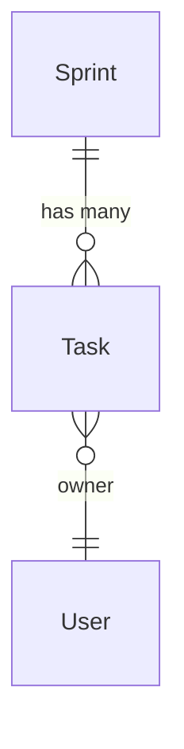

# ER Diagram Visualization

sqlmodel-nexus provides two visualization approaches: **Mermaid text output** (suitable for embedding in documentation) and **Voyager interactive visualization** (suitable for development debugging and team collaboration).

## Option 1: Mermaid Text Output

Suitable for embedding in READMEs, PRs, Wikis, and other static documentation.

### ErDiagram Class

```python
from sqlmodel_nexus import ErDiagram

# From ErManager
diagram = er.get_diagram()

# Or build directly
diagram = ErDiagram(entities=[Sprint, Task, User])
```

### Generate Output

```python
print(diagram.get_diagram())
```

Example output:



### Embed in Markdown

````markdown

````

GitHub, GitLab, and most Markdown renderers support Mermaid syntax.

### Available Methods

| Method | Return Value | Description |
|--------|-------------|-------------|
| `get_diagram()` | `str` | Mermaid ER diagram string |
| `get_all_entities()` | `list` | All registered entities |
| `get_all_relationships()` | `list` | All registered relationships |

## Option 2: Voyager Interactive Visualization

sqlmodel-nexus includes a built-in Voyager module that provides web-based interactive visualization, showing both UseCase service structure and ER entity relationships.

### Quick Start

```python
from sqlmodel_nexus.voyager import create_use_case_voyager
from sqlmodel_nexus.use_case import UseCaseAppConfig
from fastapi import FastAPI

# Create Voyager application
voyager = create_use_case_voyager(
    apps=[
        UseCaseAppConfig(name="project", services=[SprintService, TaskService]),
    ],
    er_manager=er,  # Optional: integrate ER diagram
)

# Mount to FastAPI
app = FastAPI()
app.mount("/voyager", voyager)
```

Visit `http://localhost:8000/voyager` to see the interactive interface.

### Features

- **Service graph**: Display UseCaseService methods and their DTO dependencies
- **ER diagram**: Display SQLModel entity relationships (ORM + custom)
- **DOT rendering**: Graphviz format relationship graphs
- **Interactive browsing**: Search, filter, zoom
- **DefineSubset tracking**: Display DTO → source entity mappings

### REST Endpoints

| Endpoint | Description |
|----------|-------------|
| `/dot` | DOT format service dependency graph |
| `/dot-search` | Searchable DOT graph |
| `/er-diagram` | Mermaid ER diagram |
| `/source` | Source code information |

## Selection Guide

| Scenario | Mermaid | Voyager |
|----------|---------|---------|
| Embed in README / docs | Suitable | Not suitable |
| PR / Wiki discussion diagrams | Suitable | Not suitable |
| Rapid validation during development | Fair | Very suitable |
| Team collaboration discussions | Fair | Very suitable |
| Debugging relationship loading | Not suitable | Very suitable |

## Modeling Discussion Workflow

1. **Define entities**: SQLModel defines business entities
2. **Declare relationships**: ORM relationships auto-discovered + non-ORM relationships manually declared
3. **Quick validation**: Launch Voyager, interactively check relationships in browser
4. **Document**: Use `ErDiagram.get_diagram()` to generate Mermaid, embed in docs

## Next Steps

- [Voyager Advanced](../advanced/voyager.md) — Complete Voyager configuration and advanced features
- [Custom Relationships](./custom_relationship.md) — Extending ER diagrams with non-ORM relationships
- [ER Diagram & Non-ORM Relationships](./er_diagram.md) — Relationship declaration and discovery
