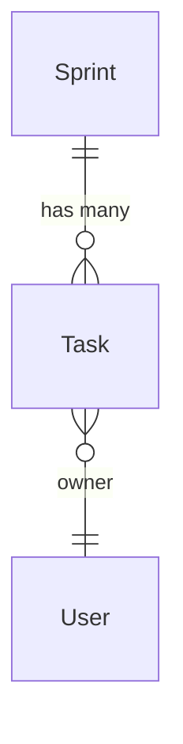

# ER Diagram Visualization

You've set up ErManager and declared your relationships. Now you want to see them — to validate the model, discuss with teammates, or document the schema.

nexusx provides two approaches: **Mermaid** for static documentation and **Voyager** for interactive exploration.

## Step 1: Generate a Mermaid Diagram

The quickest way to see your entity graph — one function call:

```python
# From an existing ErManager
diagram = er.get_diagram()

# Or build directly from entities
from nexusx import ErDiagram
diagram = ErDiagram(entities=[Sprint, Task, User])

print(diagram.get_diagram())
```

Output:



### Embed in documentation

Wrap the output in a Mermaid code block — GitHub, GitLab, and most Markdown renderers support it natively:

````markdown

````

### Available methods

| Method | Returns | Use for |
|--------|---------|---------|
| `get_diagram()` | `str` | Mermaid ER diagram string |
| `get_all_entities()` | `list` | Inspecting registered entities |
| `get_all_relationships()` | `list` | Inspecting registered relationships |

## Step 2: Explore Interactively with Voyager

Mermaid is static. When you're actively developing or debugging relationships, you need to search, filter, and zoom. Voyager provides a web-based interactive interface.

```python
from nexusx.voyager import create_use_case_voyager
from nexusx.use_case import UseCaseAppConfig
from fastapi import FastAPI

voyager = create_use_case_voyager(
    apps=[
        UseCaseAppConfig(name="project", services=[SprintService, TaskService]),
    ],
    er_manager=er,  # Optional: show ER diagram alongside service graph
)

app = FastAPI()
app.mount("/voyager", voyager)
```

Visit `http://localhost:8000/voyager` to browse:
- **ER diagram**: All SQLModel entity relationships (ORM + custom)
- **Service graph**: UseCaseService methods and their DTO dependencies
- **DefineSubset tracking**: DTO → source entity mappings
- **DOT rendering**: Graphviz format relationship graphs

### REST endpoints

| Endpoint | Returns |
|----------|---------|
| `/er-diagram` | Mermaid ER diagram |
| `/dot` | DOT format service dependency graph |
| `/dot-search` | Searchable DOT graph |
| `/source` | Source code information |

## Which One to Use?

| | Mermaid | Voyager |
|---|---------|---------|
| README / docs embedding | Yes | No |
| PR / Wiki diagrams | Yes | No |
| Development debugging | Limited | Yes |
| Team collaboration | Limited | Yes |
| Relationship validation | No | Yes |

Start with Voyager during development to interactively verify your model. Once stable, generate Mermaid for your documentation.

## Recap

- `er.get_diagram()` generates Mermaid text — embed in READMEs, PRs, Wikis
- Voyager provides interactive exploration — search, filter, zoom, debug relationships
- Use Voyager during development, Mermaid for documentation
- Both pull from the same relationship data registered in ErManager

## Next Steps

- [Voyager Advanced](../advanced/voyager.md) — Complete Voyager configuration and advanced features
- [Custom Relationships](./custom_relationship.md) — Extending ER diagrams with non-ORM relationships
