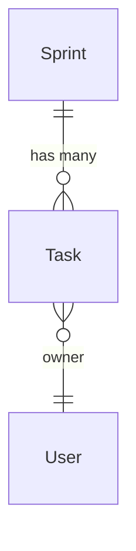

# ER 图可视化

sqlmodel-nexus 提供两种可视化方式：**Mermaid 文本输出**（适合嵌入文档）和 **Voyager 交互式可视化**（适合开发调试和团队协作）。

## 方式一：Mermaid 文本输出

适合嵌入 README、PR、Wiki 等静态文档场景。

### ErDiagram 类

```python
from sqlmodel_nexus import ErDiagram

# 从 ErManager 获取
diagram = er.get_diagram()

# 或者直接构建
diagram = ErDiagram(entities=[Sprint, Task, User])
```

### 生成输出

```python
print(diagram.get_diagram())
```

输出示例：



### 在 Markdown 中嵌入

````markdown

````

GitHub、GitLab 和大多数 Markdown 渲染器都支持 Mermaid 语法。

### 可用方法

| 方法 | 返回值 | 说明 |
|------|--------|------|
| `get_diagram()` | `str` | Mermaid ER 图字符串 |
| `get_all_entities()` | `list` | 所有已注册实体 |
| `get_all_relationships()` | `list` | 所有已注册关系 |

## 方式二：Voyager 交互式可视化

sqlmodel-nexus 内置 Voyager 模块，提供基于 Web 的交互式可视化，同时展示 UseCase 服务结构和 ER 实体关系。

### 快速开始

```python
from sqlmodel_nexus.voyager import create_use_case_voyager
from sqlmodel_nexus.use_case import UseCaseAppConfig
from fastapi import FastAPI

# 创建 Voyager 应用
voyager = create_use_case_voyager(
    apps=[
        UseCaseAppConfig(name="project", services=[SprintService, TaskService]),
    ],
    er_manager=er,  # 可选：集成 ER 图
)

# 挂载到 FastAPI
app = FastAPI()
app.mount("/voyager", voyager)
```

访问 `http://localhost:8000/voyager` 即可看到交互式界面。

### 功能

- **服务图**：展示 UseCaseService 方法及其 DTO 依赖关系
- **ER 图**：展示 SQLModel 实体关系（ORM + 自定义）
- **DOT 渲染**：Graphviz 格式的关系图
- **交互式浏览**：搜索、过滤、缩放
- **DefineSubset 追踪**：展示 DTO → 源实体的对应关系

### REST 端点

| 端点 | 说明 |
|------|------|
| `/dot` | DOT 格式服务依赖图 |
| `/dot-search` | 可搜索的 DOT 图 |
| `/er-diagram` | Mermaid ER 图 |
| `/source` | 源代码信息 |

## 选择指南

| 场景 | Mermaid | Voyager |
|------|---------|---------|
| 嵌入 README / 文档 | 适合 | 不适合 |
| PR / Wiki 讨论图 | 适合 | 不适合 |
| 开发阶段快速验证 | 一般 | 非常适合 |
| 团队协作讨论 | 一般 | 非常适合 |
| 调试关系加载 | 不适合 | 非常适合 |

## 建模讨论工作流

1. **定义实体**：SQLModel 定义业务实体
2. **声明关系**：ORM 关系自动发现 + 非 ORM 关系手动声明
3. **快速验证**：启动 Voyager，浏览器中交互式检查关系是否正确
4. **文档化**：用 `ErDiagram.get_diagram()` 生成 Mermaid，嵌入文档

## 下一步

- [Voyager 进阶](../advanced/voyager.zh.md) — Voyager 完整配置和高级功能
- [自定义关系](./custom_relationship.zh.md) — 扩展 ER 图中的非 ORM 关系
- [ER 图与非 ORM 关系](./er_diagram.zh.md) — 关系声明和自动发现
