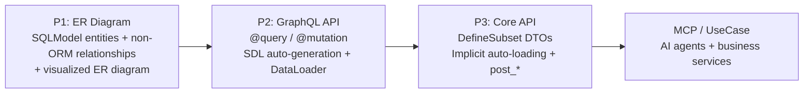
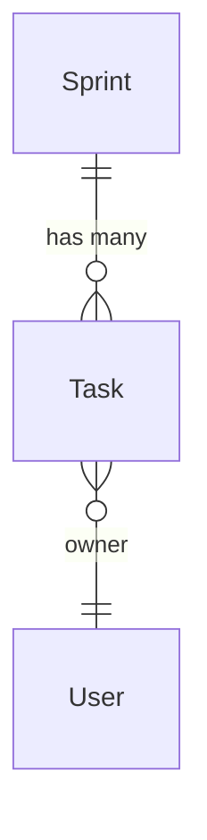

# sqlmodel-nexus

**sqlmodel-nexus** is a progressive SQLModel extension library. Start from ORM entities, extend with non-ORM relationships, auto-generate GraphQL APIs, and use `DefineSubset` to declaratively build response DTOs. Visualize entity relationships and data flows through ER diagrams.

## What sqlmodel-nexus Solves

| Need | What You Write | What the Framework Handles |
|------|----------------|---------------------------|
| GraphQL API | `@query` / `@mutation` decorators | Auto-generate SDL, DataLoader batch-loading relationships |
| REST / Use-case DTOs | `DefineSubset` + field declarations | Implicit auto-loading, N+1 prevention, ORM→DTO conversion |
| Derived fields | `post_*` methods | Auto-execute after nested data is ready |
| Cross-layer data flow | `ExposeAs`, `SendTo`, `Collector` | Pass context downward or aggregate results upward |
| Non-ORM relationships | `Relationship(...)` | Same DataLoader infrastructure, supports auto-loading |
| AI-ready API | `config_simple_mcp_server(base=...)` | Progressive MCP tool exposure |

## Use Cases

- **Backend developers**: Quickly build GraphQL and REST APIs from SQLModel entities
- **Teams**: Auto-generate APIs after models stabilize, reducing hand-written schemas
- **Projects**: Support both GraphQL for validation and REST for delivery
- **AI integration**: Expose the same models to AI agents via MCP

## Learning Path

The guide reuses the same business scenario:

### Guide (Tutorial Path)

| Page | Main Question Answered |
|------|------------------------|
| [Quick Start](./guide/quick_start.md) | How to get a GraphQL API running with minimal code? |
| [ER Diagram & Non-ORM Relationships](./guide/er_diagram.md) | How to declare and visualize entity relationships? |
| [GraphQL Mode](./guide/graphql_mode.md) | What is the full workflow from SQLModel to GraphQL API? |
| [GraphQL Pagination](./guide/graphql_pagination.md) | How to paginate list relationships? |
| [Auto Query](./guide/graphql_auto_query.md) | How to skip @query and auto-generate by_id / by_filter? |
| [Core API Mode](./guide/core_api.md) | How do DefineSubset + implicit auto-loading work? |
| [Core API Advanced](./guide/core_api_advanced.md) | How to use resolve_* / post_* / cross-layer data flow? |
| [Custom Relationships](./guide/custom_relationship.md) | How to declare and use non-ORM relationships? |
| [ER Diagram Visualization](./guide/er_diagram_visual.md) | How to generate and embed Mermaid ER diagrams? |

### Advanced Guides

| Page | Topic |
|------|-------|
| [MCP Service](./advanced/mcp_service.md) | Expose SQLModel APIs to AI agents |
| [UseCase Service](./advanced/use_case_service.md) | Define business services serving both MCP and REST |
| [UseCase + FastAPI](./advanced/use_case_fastapi.md) | Embed the same service class into FastAPI routes |
| [Voyager Visualization](./advanced/voyager.md) | Interactive ERD browsing |

### API Reference

- [GraphQLHandler](./api/api_graphql_handler.md) — GraphQL entry point + SDL generation
- [Core API](./api/api_core.md) — ErManager / Resolver / DefineSubset / Loader
- [Cross-layer Data Flow](./api/api_cross_layer.md) — ExposeAs / SendTo / Collector
- [Relationships & ER Diagram](./api/api_relationship.md) — Relationship / ErDiagram
- [MCP API](./api/api_mcp.md) — MCP service configuration
- [UseCase API](./api/api_use_case.md) — UseCaseService / create_use_case_mcp_server
