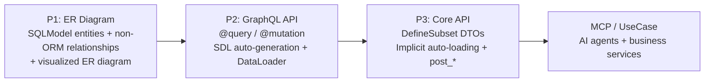
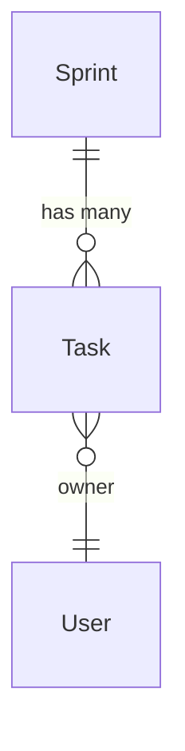

# nexusx

**nexusx** is a progressive SQLModel extension. You start from ORM entities, add non-ORM relationships, auto-generate GraphQL APIs, and build response DTOs declaratively with `DefineSubset`. Everything is visualized through ER diagrams.

## What You'll Get

| You want... | You write... | nexusx handles... |
|------|----------------|---------------------------|
| A GraphQL API | `@query` / `@mutation` decorators | SDL generation, DataLoader batch-loading |
| REST or use-case DTOs | `DefineSubset` + field declarations | Implicit auto-loading, N+1 prevention, ORM→DTO conversion |
| Derived fields | `post_*` methods | Auto-execute after nested data is ready |
| Cross-layer data flow | `ExposeAs`, `SendTo`, `Collector` | Pass context downward, aggregate results upward |
| Non-ORM relationships | `Relationship(...)` | Same DataLoader infrastructure, supports auto-loading |
| An AI-ready API | `create_simple_mcp_server(base=...)` | Progressive MCP tool exposure |

## Who Is This For

- **Backend developers** building GraphQL and REST APIs from SQLModel entities
- **Teams** that want auto-generated APIs once models stabilize — no more hand-written schemas
- **Projects** that need both GraphQL for flexibility and REST for delivery
- **AI integrations** that expose the same models to AI agents via MCP

## Learning Path

Every guide reuses the same business scenario so you can follow along step by step:

### Guide (Tutorial Path)

| Page | What You'll Learn |
|------|------------------------|
| [Quick Start](./guide/quick_start.md) | Get a GraphQL API running in 30 seconds |
| [ER Diagram & Non-ORM Relationships](./guide/er_diagram.md) | Declare and visualize entity relationships |
| [GraphQL Mode](./guide/graphql_mode.md) | The full workflow from SQLModel to GraphQL API |
| [GraphQL Pagination](./guide/graphql_pagination.md) | Paginate list relationships |
| [Auto Query](./guide/graphql_auto_query.md) | Skip `@query` and auto-generate `by_id` / `by_filter` |
| [Core API Mode](./guide/core_api.md) | Build REST responses with `DefineSubset` + implicit auto-loading |
| [Core API Advanced](./guide/core_api_advanced.md) | Use `resolve_*` / `post_*` / cross-layer data flow |
| [Custom Relationships](./guide/custom_relationship.md) | Declare and use non-ORM relationships |
| [Virtual Entities](./guide/virtual_entities.md) | Use plain `BaseModel` roots (`CurrentUser`, page wrappers, third-party DTOs) via `add_virtual_entities()` |
| [ER Diagram Visualization](./guide/er_diagram_visual.md) | Generate and embed Mermaid ER diagrams |

### Advanced Guides

| Page | What You'll Learn |
|------|-------|
| [MCP Service](./advanced/mcp_service.md) | Expose SQLModel APIs to AI agents |
| [UseCase Service](./advanced/use_case_service.md) | Define business services serving both MCP and REST |
| [UseCase + FastAPI](./advanced/use_case_fastapi.md) | Embed the same service class into FastAPI routes |
| [Voyager Visualization](./advanced/voyager.md) | Interactive ERD browsing |

### API Reference

- [GraphQLHandler](./api/api_graphql_handler.md) — GraphQL entry point + SDL generation
- [Core API](./api/api_core.md) — ErManager / Resolver / DefineSubset / Loader
- [Cross-layer Data Flow](./api/api_cross_layer.md) — ExposeAs / SendTo / Collector
- [Relationships & ER Diagram](./api/api_relationship.md) — Relationship / ErDiagram
- [MCP API](./api/api_mcp.md) — MCP service configuration
- [UseCase API](./api/api_use_case.md) — UseCaseService / create_use_case_graphql_mcp_server
