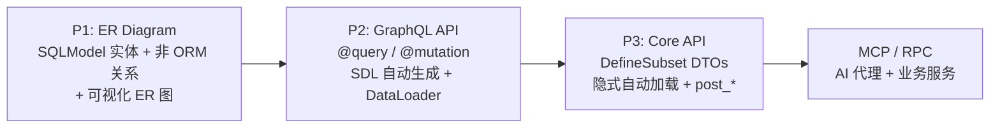
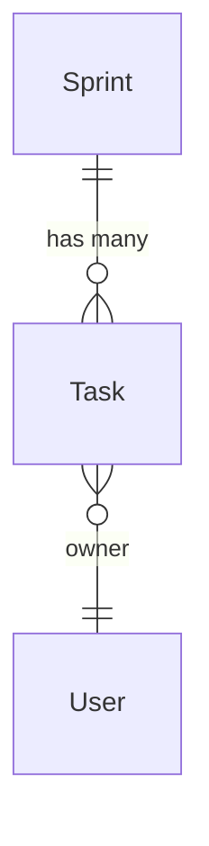

# sqlmodel-nexus

**sqlmodel-nexus** 是一个渐进式 SQLModel 扩展库。从 ORM 实体出发，扩展非 ORM 关系，自动生成 GraphQL API，并用 `DefineSubset` 声明式构建响应 DTO。通过 ER 图可视化实体关系和数据流。

## sqlmodel-nexus 能解决什么

| 需求 | 你写什么 | 框架负责什么 |
|------|----------|--------------|
| GraphQL API | `@query` / `@mutation` 装饰器 | 自动生成 SDL，DataLoader 批量加载关系 |
| REST / 用例 DTO | `DefineSubset` + 字段声明 | 隐式自动加载，N+1 预防，ORM→DTO 转换 |
| 派生字段 | `post_*` 方法 | 在嵌套数据就绪后自动执行 |
| 跨层传递数据 | `ExposeAs`、`SendTo`、`Collector` | 向下传上下文，或向上聚合结果 |
| 非 ORM 关系 | `Relationship(...)` | 同一 DataLoader 基础设施，支持自动加载 |
| AI 就绪 API | `config_simple_mcp_server(base=...)` | 渐进式 MCP 工具暴露 |

## 适用场景

- **后端开发者**：从 SQLModel 实体快速构建 GraphQL 和 REST API
- **团队**：想在模型稳定后自动生成 API，减少手写 schema
- **项目**：需要同时支持 GraphQL 验证和 REST 交付
- **AI 集成**：将同一套模型通过 MCP 暴露给 AI 代理

## 学习路径

指南部分复用同一套业务场景：

### 指南（教程路径）

| 页面 | 主要回答的问题 |
|---|---|
| [快速开始](./guide/quick_start.zh.md) | 如何用最小代码跑起来一个 GraphQL API？ |
| [ER 图与非 ORM 关系](./guide/er_diagram.zh.md) | 如何声明和可视化实体关系？ |
| [GraphQL 模式](./guide/graphql_mode.zh.md) | 从 SQLModel 到 GraphQL API 的完整流程是什么？ |
| [GraphQL 分页](./guide/graphql_pagination.zh.md) | 列表关系如何分页？ |
| [自动查询](./guide/graphql_auto_query.zh.md) | 如何跳过 @query，自动生成 by_id / by_filter？ |
| [Core API 模式](./guide/core_api.zh.md) | DefineSubset + 隐式自动加载如何工作？ |
| [Core API 进阶](./guide/core_api_advanced.zh.md) | resolve_* / post_* / 跨层数据流怎么用？ |
| [自定义关系](./guide/custom_relationship.zh.md) | 非 ORM 关系如何声明和使用？ |
| [ER 图可视化](./guide/er_diagram_visual.zh.md) | 如何生成和嵌入 Mermaid ER 图？ |

### 进阶指南

| 页面 | 主题 |
|---|---|
| [MCP 服务](./advanced/mcp_service.zh.md) | 将 SQLModel API 暴露给 AI 代理 |
| [UseCase 服务](./advanced/use_case_service.zh.md) | 定义业务服务，同时服务于 MCP 和 REST |
| [UseCase + FastAPI](./advanced/use_case_fastapi.zh.md) | 同一服务类嵌入 FastAPI 路由 |
| [Voyager 可视化](./advanced/voyager.zh.md) | 交互式 ERD 浏览 |

### API 参考

- [GraphQLHandler](./api/api_graphql_handler.zh.md) — GraphQL 入口 + SDL 生成
- [Core API](./api/api_core.zh.md) — ErManager / Resolver / DefineSubset / Loader
- [跨层数据流](./api/api_cross_layer.zh.md) — ExposeAs / SendTo / Collector
- [关系与 ER 图](./api/api_relationship.zh.md) — Relationship / ErDiagram
- [MCP API](./api/api_mcp.zh.md) — MCP 服务配置
- [UseCase API](./api/api_use_case.zh.md) — UseCaseService / create_use_case_mcp_server
